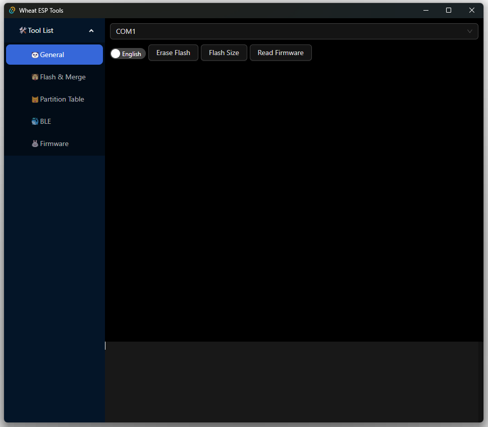
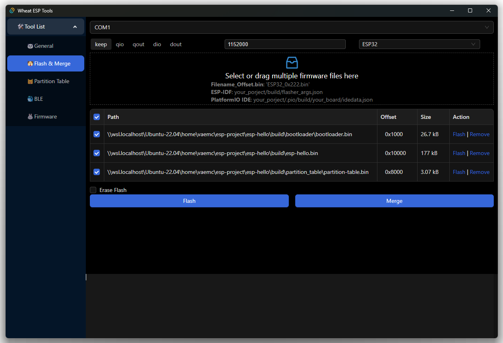
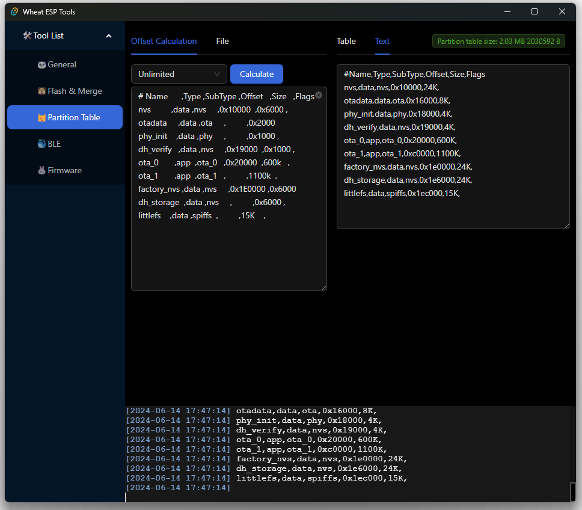
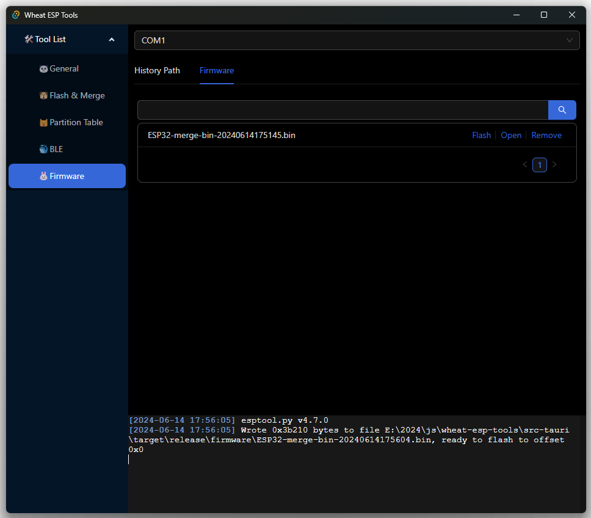

# Wheat ESP Tools

[简体中文](./README.md) | English

## General

## Flash & Merge
* Support parsing firmware in file name: 
  Filename_Offset.bin: 'ESP32_0x222.bin'
  
* Support importing ESP-IDF project firmware into tool list

  your_porject/build/flasher_args.json

* Support importing the firmware of PlatformIO IDE project into the tool list

  your_porject/.pio/build/your_board/idedata.json

## Partition Table
✅ Fill in the offset address of the partition table and align it

✅ Partition table firmware to CSV

## Firmware
✅ History Path

✅ Search firmware

