# Wheat ESP Tools

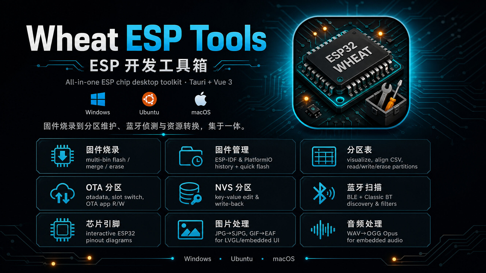

A desktop toolkit for ESP series chips. Covers firmware flash and merge, partition tables, OTA, NVS, Bluetooth scanning, chip pinout diagrams, embedded image and audio format conversion, and mmap asset packing. Built with [Tauri](https://tauri.app/) and [Vue 3](https://vuejs.org/), with [esptool](https://github.com/espressif/esptool) built in — no separate CLI install required.

[简体中文](./README.md) | English

---

## Table of Contents

- [Overview](#overview)
- [Feature Summary](#feature-summary)
- [Requirements](#requirements)
- [Installation](#installation)
- [UI Layout](#ui-layout)
- [Device Connection](#device-connection)
- [Firmware Flash](#firmware-flash)
- [Firmware Management](#firmware-management)
- [Partition Table](#partition-table)
- [OTA Partitions](#ota-partitions)
- [NVS Partition](#nvs-partition)
- [Bluetooth](#bluetooth)
- [Chip Pinout](#chip-pinout)
- [Image Tools](#image-tools)
- [Audio Tools](#audio-tools)
- [File Tools](#file-tools)
- [Terminal Output](#terminal-output)
- [Data Directories](#data-directories)
- [Feature Status](#feature-status)
- [License](#license)

---

## Overview

Wheat ESP Tools gathers common ESP development tasks into one desktop app — from serial flashing and partition maintenance to Bluetooth discovery and asset conversion. Serial operations run through the built-in esptool; Bluetooth scanning and capabilities such as NVS parsing and GIF→EAF conversion are implemented in the Tauri native layer.

The sidebar is grouped by purpose:

| Group | Modules |
|-------|---------|
| Flash & partitions | Firmware Flash, Firmware Management, Partition Table, OTA Partitions, NVS Partition |
| Bluetooth & pinout | Bluetooth, Chip Pinout |
| Utilities | Image Tools, Audio Tools, File Tools |

UI language supports Simplified Chinese and English; switch inside the app.

---

## Feature Summary

| Module | Description |
|--------|-------------|
| Firmware Flash | Multi-firmware list, batch/single-row flash, merge to one `.bin`, export copies, full-chip erase/read |
| Firmware Management | ESP-IDF / PlatformIO project history, local firmware library, quick flash |
| Partition Table | CSV offset alignment, read from device with visualization, per-partition read/write/erase |
| OTA Partitions | Parse otadata, switch boot slot, OTA app partition read/write/erase |
| NVS Partition | Read from device or file, edit key-values, write back, generate image from CSV |
| Bluetooth | BLE advertisement scan and filters; classic Bluetooth (BR/EDR) discovery on Windows |
| Chip Pinout | Interactive ESP32-family pinout with category filter and datasheet links |
| Image Tools | JPG→SJPG, GIF→EAF for LVGL / embedded displays |
| Audio Tools | WAV→OGG (Opus); can detect Opus / Vorbis / FLAC |
| File Tools | Pack an assets folder into an mmap `.bin`; preview the map table and `index.json` |

---

## Requirements

| Item | Requirement |
|------|-------------|
| OS | Windows (primary platform; classic Bluetooth depends on WinRT) |
| Hardware | ESP board and a working USB serial driver (e.g. CH340, CP2102) |
| Build from source (optional) | Node.js 18+, Yarn, Rust toolchain |

---

## Installation

### Pre-built installer

Download from [Releases](https://github.com/vaemc/wheat-esp-tools/releases), run the setup wizard, then launch **Wheat ESP Tools**.

### Build from source

```bash
yarn install
yarn tauri dev      # development
yarn tauri build    # production installer
```

Artifacts are under `src-tauri/target/release/bundle/`.

---

## UI Layout

| Area | Content |
|------|---------|
| Top bar | Serial port selector, device info, **Get device info** |
| Left sidebar | Feature menu (grouped) |
| Main area | Active tool page; recent pages kept alive (up to 6) |
| Bottom bar | xterm terminal for esptool logs and progress |

Default page: **Firmware Flash**.

---

## Device Connection

Device-facing features (flash, partition table, OTA, NVS, etc.) require a serial port selected in the top bar. Without one, related actions prompt you to select a port first.

### Steps

1. Connect the board to the PC over USB.
2. Open **Serial port** in the top bar (the COM list refreshes when opened) and pick the target port.
3. Click **Get device info** to read chip and Flash details via esptool.
4. Changing the port clears cached device info; fetch again as needed.

### Information shown

- Chip model and revision
- MAC address (click to copy)
- Flash size, type, Flash ID
- PSRAM, crystal frequency, feature summary
- Security and other details (**More** panel)

Serial port details can also show friendly name, USB description, and serial number.

> Device info is not read automatically after selecting a port. Click **Get device info** manually.

---

## Firmware Flash

Main entry for multi-firmware flash, merge, and Flash-level shortcuts.

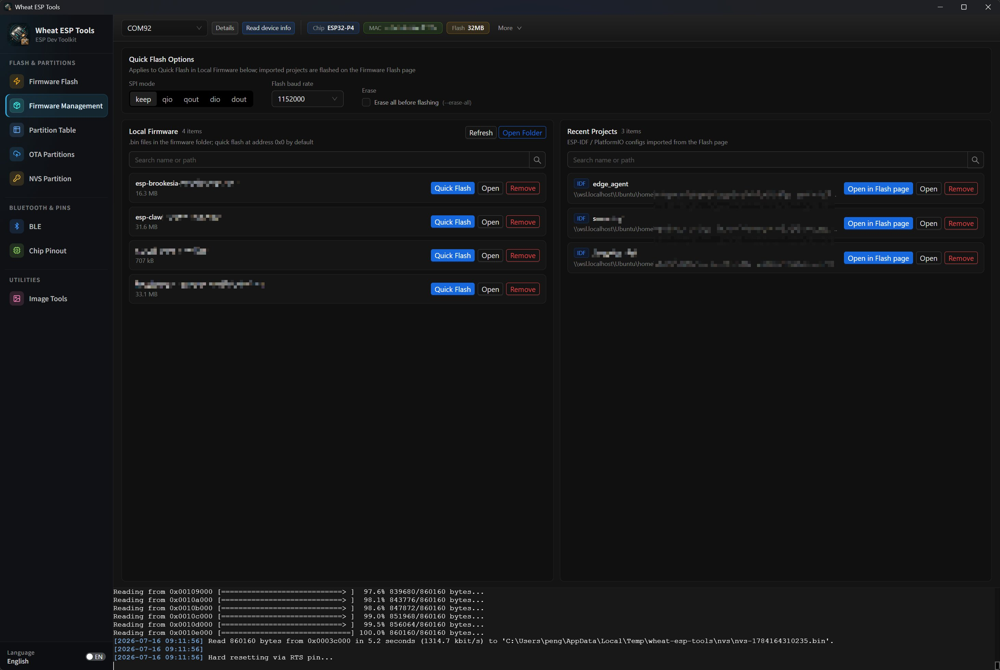

### Adding firmware

Three sources are supported:

#### 1. Drop or select `.bin`

The first hex flash address (`0x` prefix) can be parsed from the filename:

```
name_0xaddress.bin
```

Example: `ESP32_0x10000.bin` → address `0x10000`. Multiple files can be added at once; addresses are editable in the list.

#### 2. ESP-IDF project config

Select or drop:

```
your_project/build/flasher_args.json
```

Parses `flash_files` and chip type, fills the list, and records the config under **Firmware Management → Recent projects**.

#### 3. PlatformIO project config

Select or drop:

```
your_project/.pio/build/your_board/idedata.json
```

Same idea as ESP-IDF; also saved to recent projects.

### Toolbar parameters

| Parameter | Description |
|-----------|-------------|
| SPI mode | `keep` / `qio` / `qout` / `dio` / `dout`, default `keep` |
| Flash baud rate | Default `1152000`, roughly `115200`–`1500000` |
| Chip type | Detected by esptool; **required for merge** |

### List actions

- Checkboxes: batch flash / merge / export only checked rows; header toggles all
- Flash address: edit per row
- Flash this row: write the current row only
- Delete: remove from the list

### Flash

1. Check target firmware and confirm addresses.
2. Optionally check **Erase flash before flashing** (`--erase-all`).
3. Click **Flash**; progress and logs appear in the bottom terminal.

Equivalent command example:

```bash
esptool.py -p COMx -b 1152000 write-flash --flash-mode keep 0x10000 firmware.bin ...
```

### Merge firmware

Merge multiple `.bin` files by address into one file (does not write to the device):

1. Select chip type.
2. Check the firmware to merge.
3. Click **Merge**; you can confirm the output filename.

Output is saved under the app `firmware/` directory, default name `{chip}-merge-bin-{timestamp}.bin`, then the folder opens.

### Export

Copy checked firmware to a user-chosen folder, named like `{stem}_{address}.bin`.

### Shortcuts

| Action | Description |
|--------|-------------|
| Erase flash | `erase-flash` (baud fixed at 115200) |
| Read Flash | `read-flash 0 ALL`, saved as `firmware/read-{timestamp}.bin` (baud 460800) |

---

## Firmware Management

Manages recent project configs and a local firmware library, plus quick flash.

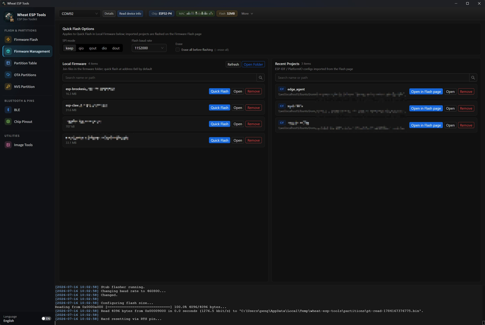

Quick-flash parameters at the top: SPI mode, baud rate, erase-before-flash (same model as the Flash page; defaults baud `1152000`, SPI `keep`).

### Recent projects

Automatically records ESP-IDF / PlatformIO configs imported from the Flash page:

- Shows project name and config path; **IDF** / **PIO** tags
- Search by name or path
- **Import to Flash page**: load config and jump to Flash
- **Open**: reveal the config file in Explorer
- **Delete**: remove the history entry

### Local firmware

Scans `.bin` files under the app `firmware/` directory:

- **Open folder**: drop files there, then refresh to list them
- **Quick flash**: write at address `0x0` with current quick-flash parameters (serial port required)
- Search, open file, delete list items

---

## Partition Table

Two sub-pages: **Device read** and **Offset alignment**. Partition table offset defaults to `0x8000` and can be changed and persisted in the app.

### Device read

Read the partition table from a connected device and operate on individual partitions.

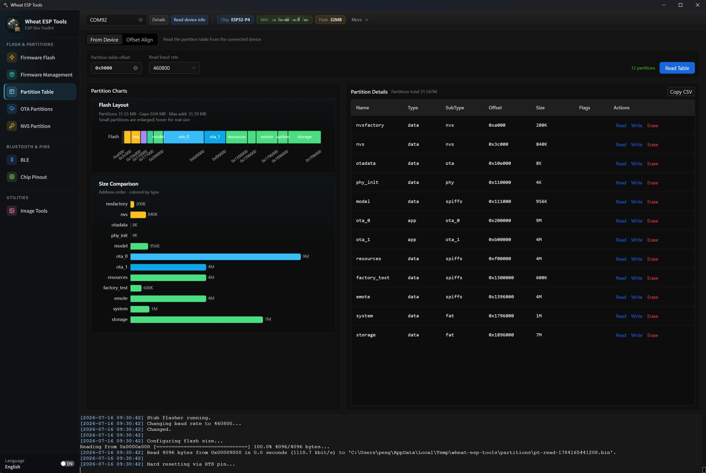

1. Confirm partition table offset and read baud rate (default `460800`).
2. Click **Read partition table**.
3. Display includes:
   - Flash layout and capacity charts
   - Detail table: name, type, subtype, offset, size, flags
   - Standard CSV (copyable)
4. Each row supports **Read / Write / Erase**:
   - Read: export a temporary `.bin` and open its folder
   - Write: pick a `.bin` no larger than the partition; hard-reset afterward
   - Erase: requires confirmation

Partition table binary backups go to the system temp directory `wheat-esp-tools/partitions/`; single-partition dumps go to `wheat-esp-tools/partition/`.

### Offset alignment

Auto-align Offset fields in ESP-IDF partition CSV — no device required.

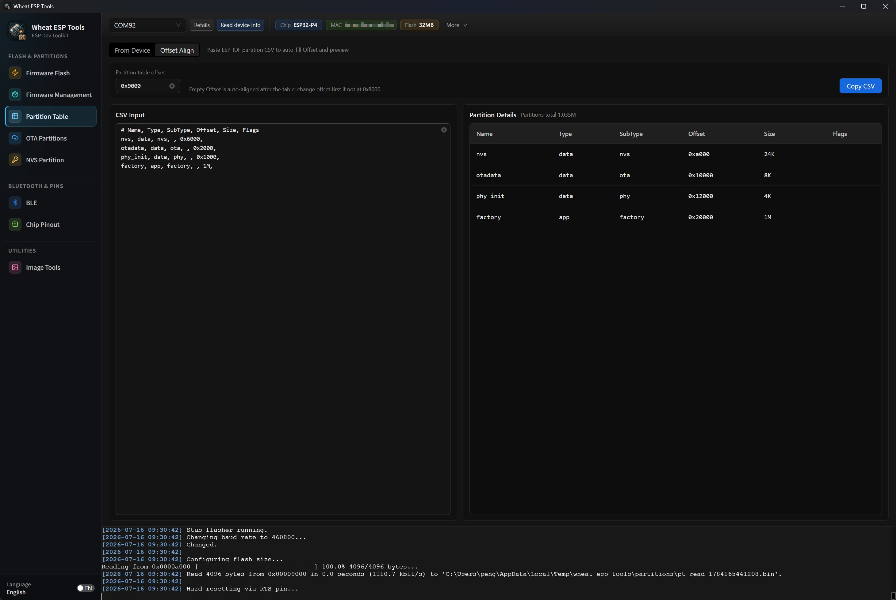

1. Paste the partition CSV on the left.
2. Rows with **empty Offset** are filled by ESP-IDF alignment rules.
3. The right side previews the result and total Flash usage in real time.
4. **Copy** places the aligned CSV on the clipboard.

Example input:

```csv
# Name, Type, SubType, Offset, Size, Flags
nvs,      data, nvs,     , 0x6000,
otadata,  data, ota,     , 0x2000,
phy_init, data, phy,     , 0x1000,
factory,  app,  factory, , 1M,
```

---

## OTA Partitions

Read the device partition table and `otadata`, inspect the active boot slot, and maintain OTA app partitions. Requires a selected serial port, plus `otadata` and OTA app partitions (e.g. `ota_0`, `ota_1`) in the table.

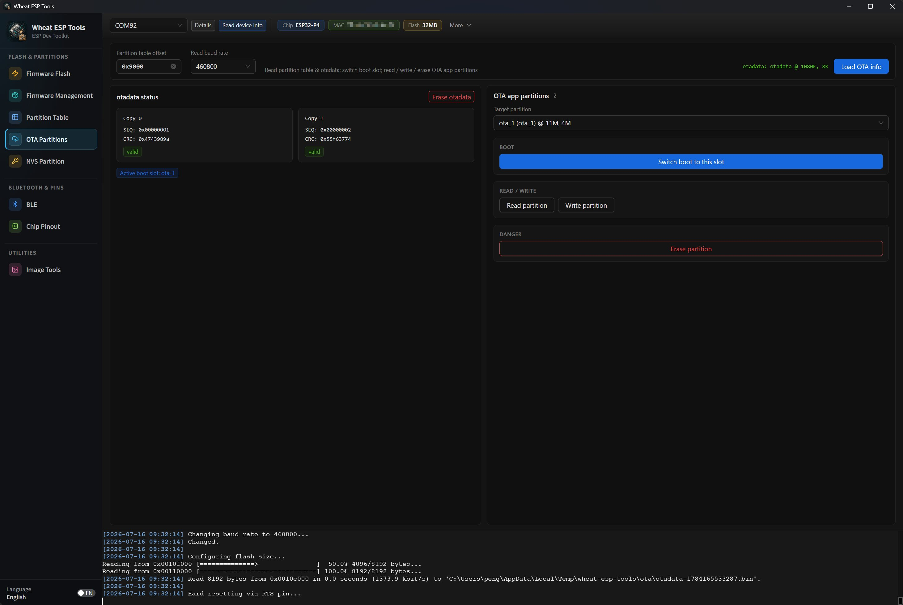

### Load info

Set partition table offset (default `0x8000`) and baud rate (default `460800`), then click **Read OTA info**. On success:

- otadata dual copies: SEQ, CRC, valid/invalid
- Active boot slot
- Detected otadata offset and size

### Actions

| Category | Action | Notes |
|----------|--------|-------|
| Boot switch | Switch boot to the selected OTA partition | Rewrites otadata; takes effect after reset |
| Partition I/O | Read / write the selected OTA partition | Write does **not** auto-switch the boot slot |
| Dangerous | Erase otadata / erase selected OTA partition | Confirmation required; erasing otadata usually falls back to factory or default policy |

Read-out example path: `{temp}/wheat-esp-tools/ota/ota_{n}-{timestamp}.bin`.

---

## NVS Partition

Read, edit, and write back ESP NVS (Non-Volatile Storage) key-value data; also open a local image or generate a partition from CSV.

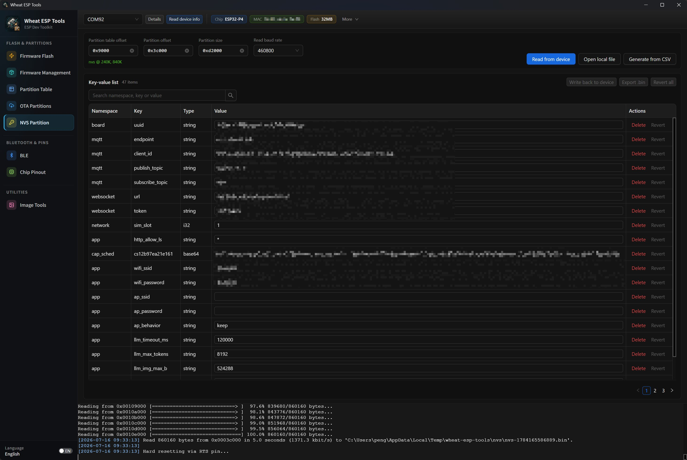

### Read from device

1. Select a serial port; confirm partition table offset (default `0x8000`) and baud rate (default `460800`).
2. Click **Read from device**: read the partition table, locate NVS offset/size, then read and parse key-values.
3. The table shows namespace, key, type, and value.

Placeholder offset/size defaults are `0x9000` / `0x6000` and are overwritten after a successful probe. Partition size must be a multiple of `0x1000`.

### Open local file

Open a `.bin` NVS partition image and parse it without a device.

### Generate from CSV

Pick an ESP-IDF standard NVS CSV and generate a `.bin` image (not flashed automatically). Output goes to the system temp directory.

### Edit and write back

| Action | Description |
|--------|-------------|
| Edit value | Inline edit for non-binary entries |
| Delete / restore | Mark for deletion; can undo |
| Revert | Undo one row or all changes |
| Export `.bin` | Rebuild binary from current edits |
| Write to device | Only when source is **Read from device**; overwrites the NVS partition after confirmation |

Before write-back, the dialog shows target offset, size, and entry count. Binary-type entries do not support inline edit yet.

### Search and copy

Filter by namespace, key, or value. Click an unmodified cell to copy.

> Empty or encrypted partitions may yield no usable keys. Write-back overwrites the target NVS partition — confirm offset and size. Temp files live under `{temp}/wheat-esp-tools/nvs/`.

---

## Bluetooth

Scan nearby Bluetooth devices. This page does not require an ESP serial port. Two modes: **BLE advertisements** and **Classic Bluetooth** (Windows).

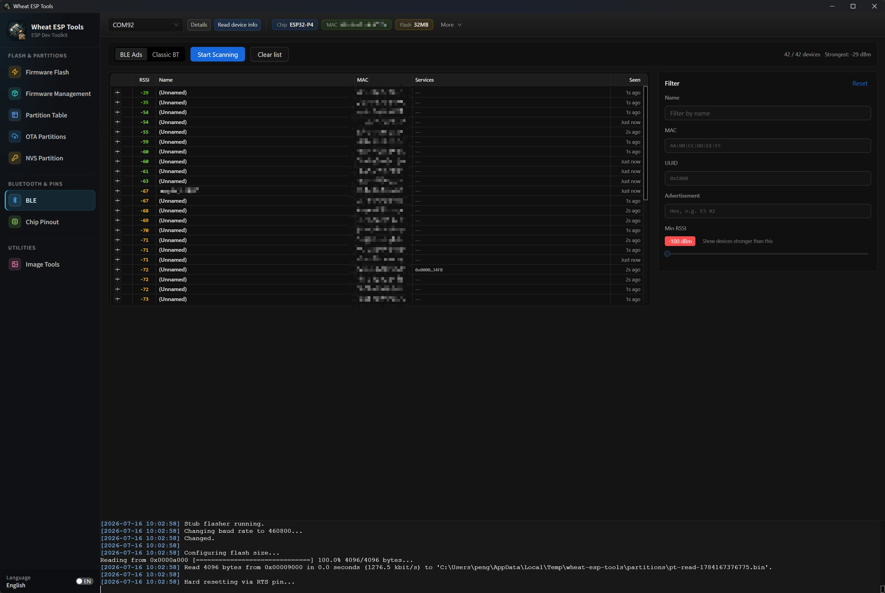

### BLE advertisements

1. Select **BLE** mode and click **Start scan**.
2. Devices sort by RSSI descending; entries not seen for about 10 seconds are removed.
3. **Stop scan** / **Clear list** end scanning or clear results.

Filters on the right can be combined:

| Filter | Description |
|--------|-------------|
| Name | Fuzzy match on advertisement name |
| MAC | Bluetooth address |
| UUID | Advertised service UUID |
| Adv data | Hex fragment matching raw payload / manufacturer / service data |
| RSSI floor | Slider, default about -100 dBm |

Expand a row for manufacturer data, service UUIDs, service data, raw payload, advertisement count, and more.

> Scan and filter only — connection and GATT read/write are not supported.

### Classic Bluetooth (Windows)

Discover BR/EDR devices via the system device watcher. The list can show name, MAC, Class of Device, major class, paired/connected/authenticated state, and system-reported RSSI (some devices have none).

Filters: name, MAC, paired only, connected only, RSSI floor. No connection or protocol-level I/O.

---

## Chip Pinout

Interactive ESP32-family pin function diagrams. Data comes from Espressif datasheets; no device connection required.

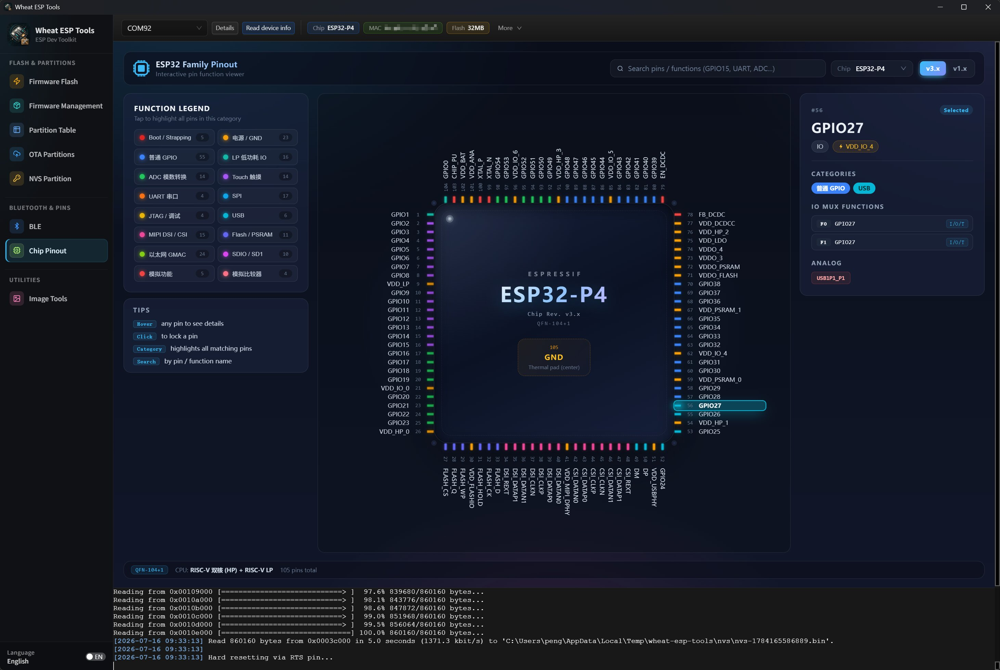

### Supported chips

| Chip | Package |
|------|---------|
| ESP32 | QFN-48 |
| ESP32-S3 | QFN-56+1 |
| ESP32-C3 | QFN-32+1 |
| ESP32-C5 | QFN-40+1 |
| ESP32-C6 | QFN-40+1 |
| ESP32-P4 | QFN-104+1 (package/revision variants) |

### Usage

1. Select chip model and package.
2. **Hover** a pin to preview details on the right; **click** to lock selection.
3. Search by pin or function name (e.g. `GPIO15`, `UART`, `ADC`) to highlight matches.
4. Click a category in the left legend to highlight all pins in that category.

### Pin details

- Function categories (GPIO, UART, SPI, ADC, …)
- Boot / strapping notes
- Levels before/after reset
- IO MUX / LP IO MUX multiplexing
- Analog functions (ADC, DAC, …)

The footer shows CPU, package, and pin count, with links to the matching datasheet.

---

## Image Tools

Convert common images to formats usable in embedded / LVGL projects. Pick a converter on the left, manage a batch in the center, set output options on the right.

### JPG to SJPG

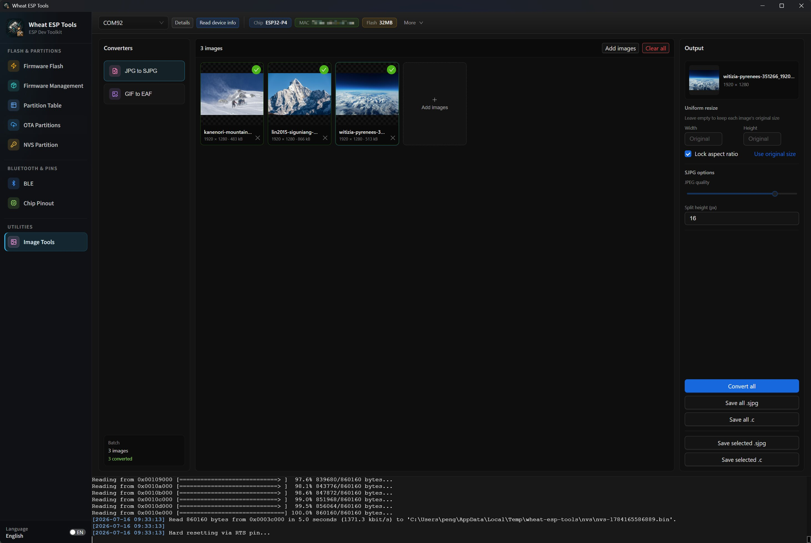

Targets LVGL SJPG (magic `_SJPG__`, version V1.00), compatible with the official `jpg_to_sjpg.py` flow: slice by split height, then JPEG-compress each strip.

| Item | Description |
|------|-------------|
| Input | JPG / PNG / WebP / BMP, batch supported |
| Output | `.sjpg` binary or `.c` source array |
| Output size | Original by default; width/height 1–4096, aspect lock optional |
| JPEG quality | Default 90 (about 50–100) |
| Split height | Default 16 px (about 8–64, step 8) |

Flow: add images → tune parameters → batch convert → save one or all outputs.

### GIF to EAF

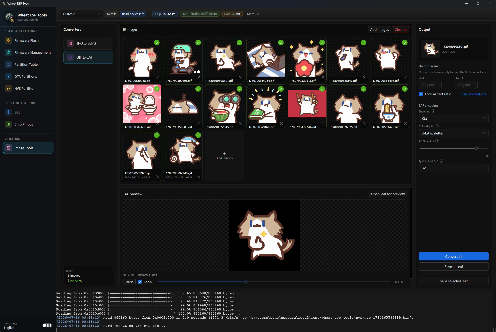

Convert GIF to `.eaf` animation binaries with playback preview.

| Item | Description |
|------|-------------|
| Input | GIF (multiple files OK) |
| Output | `.eaf` |
| Encoding | **RLE** (default), RLE+Huffman, JPEG |
| Color depth | RLE: 4 / 8 bit (default 8); JPEG fixed 24 bit |
| JPEG quality | Default 85 (about 11–100, JPEG mode only) |
| Split height | Default 32 px (commonly 16–32) |
| Output size | Follows GIF by default; editable (1–4096, must be > 10) |

Encoding trade-offs: RLE is fast to decode with moderate size; RLE+Huffman is smaller but slightly slower; JPEG tunes quality vs size. Conversion runs natively; preview supports play/pause/loop; you can also open an existing `.eaf` for preview.

---

## Audio Tools

Convert WAV to Ogg Opus (`.ogg`) commonly used on embedded devices. Layout matches Image Tools: pick a converter on the left, manage a batch in the center, set output options on the right, preview results at the bottom. Conversion runs in the frontend (`libopus-wasm`) — no local ffmpeg install required.

### WAV to OGG
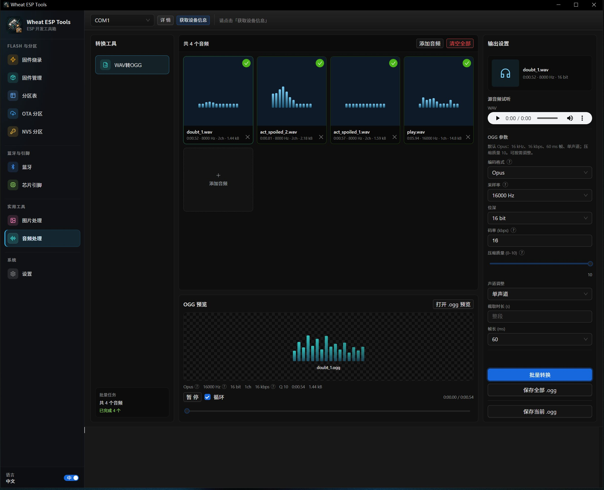

Convert PCM / IEEE Float WAV (including WAVE_FORMAT_EXTENSIBLE) to Ogg Opus.

| Item | Description |
|------|-------------|
| Input | `.wav`, batch drop or system file dialog |
| Output | `.ogg` (Opus) |
| Codec | Conversion is **Opus** only for now; opening a file can detect Opus / Vorbis / FLAC |
| Sample rate | 8000 / 12000 / 16000 / 24000 / 48000 Hz (default 16000) |
| Bitrate | Target bitrate in kbps (default 16) |
| Bit depth | Intermediate PCM quantization before Opus: 16 / 24 / 32 bit (default 16) |
| Compression quality | Opus complexity 0–10 (default 10); mainly quality/CPU, almost no size change |
| Channels | Mono by default; keep original or force stereo |
| Trim duration | Full length by default; optional trim in seconds |
| Frame size | 20 / 40 / 60 ms (default 60) |

Flow: add WAV → tune parameters → batch convert → save one or all `.ogg` files. Bottom preview supports play/pause/loop; you can also open an existing `.ogg` / `.opus` / `.oga` and see the detected codec.

> With `ffprobe`, `sample_rate` often shows 48000 (Opus decode clock), which is not the encoding rate you set. A `~` bitrate in preview is size-based and looks higher on short clips.

---

## File Tools

Pack a resource folder into an mmap-readable `.bin` (header + path table + payloads). This is not an Espressif SPIFFS / mkspiffs filesystem image. Pick a tool on the left, choose a folder in the main area, review the file list, then pack.

### mmap assets pack
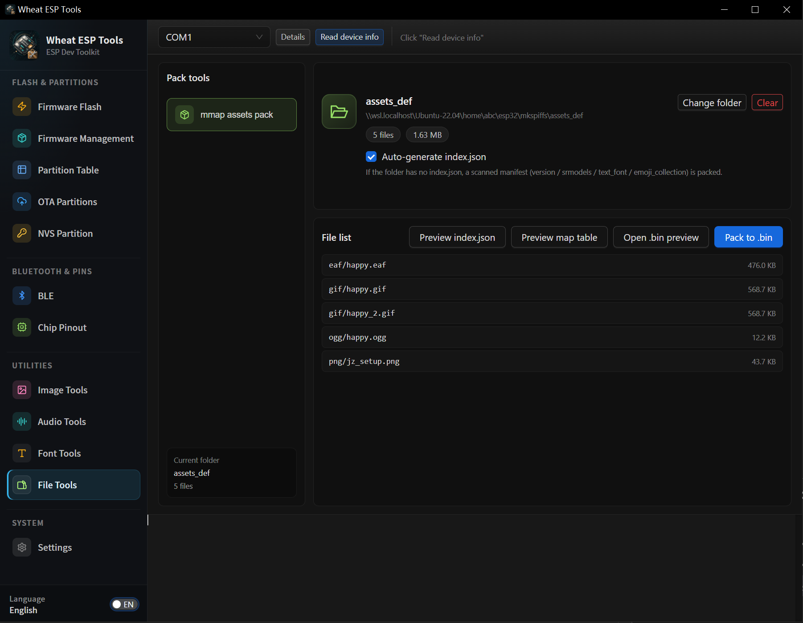

Recursively scan an assets root and build an mmap image suitable for partitions such as `assets`.

| Item | Description |
|------|-------------|
| Input | Assets folder (png / jpeg / gif / ogg / eaf / txt, etc.; subfolders become relative paths) |
| Output | mmap-format `.bin` |
| Path limit | Each relative path must be at most 31 characters |
| index.json | Packed as-is if present; otherwise optionally auto-generated (`version` / `srmodels` / `text_font` / `emoji_collection`, …) |
| Skipped | `config.json` |

Flow: choose or drop the assets root → review the file list and manifest options → pack to `.bin`. You can preview the map table (`name` / `size` / `offset`), preview or extract `index.json` from a `.bin`, or open a `.bin` to list packed files.

---

## Terminal Output

The bottom xterm is used for:

- esptool stdout
- Progress for flash/read and similar operations
- Timestamped command logs (`[YYYY-MM-DD HH:mm:ss]`)

Do not close the app while flashing. On failure, check port occupancy, drivers, wiring, and baud rate first. Ctrl+C copies selected text in the terminal.

---

## Data Directories

### App working directory

| Path | Contents |
|------|----------|
| `firmware/` | Merged firmware, full Flash read backups, local firmware library |

### System temp (`{temp}/wheat-esp-tools/`)

| Subdir | Contents |
|--------|----------|
| `partitions/` | Partition table read backups |
| `partition/` | Single-partition dumps |
| `nvs/` | NVS read, export, CSV generation |
| `ota/` | OTA / otadata related backups |

---

## Feature Status

| Feature | Status |
|---------|--------|
| Multi-firmware flash / merge / export | Done |
| ESP-IDF / PlatformIO config import | Done |
| Parse flash address from filename | Done |
| Full Flash erase / read | Done |
| Partition CSV offset alignment | Done |
| Read partition table from device + visualization | Done |
| Per-partition read / write / erase | Done |
| OTA I/O, boot slot switch, erase otadata | Done |
| NVS read, edit, export, write-back, CSV generate | Done |
| Recent projects / local firmware quick flash | Done |
| BLE advertisement scan and multi-filter | Done |
| Classic Bluetooth scan (Windows) | Done |
| ESP32-family interactive pinout | Done |
| JPG→SJPG / GIF→EAF | Done |
| WAV→OGG (Opus) | Done |
| mmap assets pack | Done |
| Bluetooth connect and GATT | Not implemented |

---

## License

This project is released under the [MIT License](./LICENSE).
