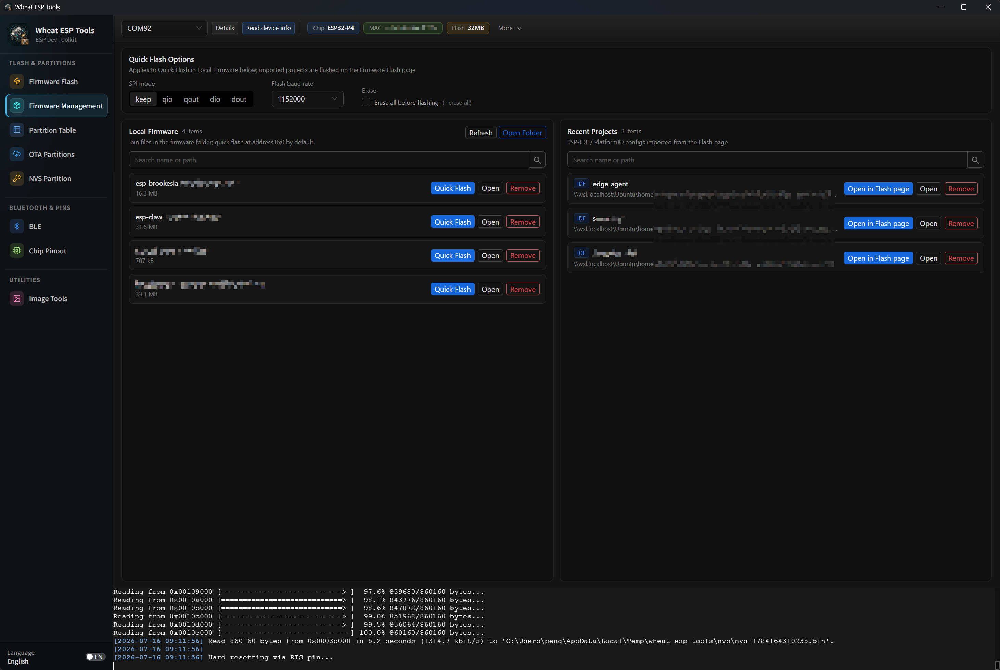
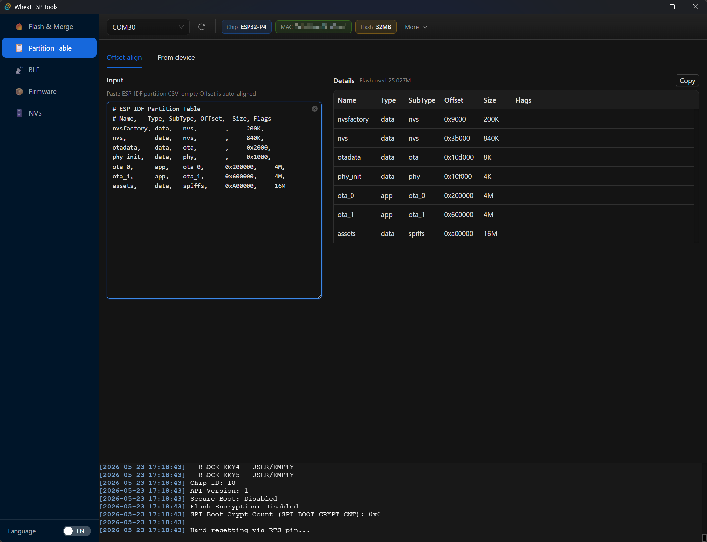
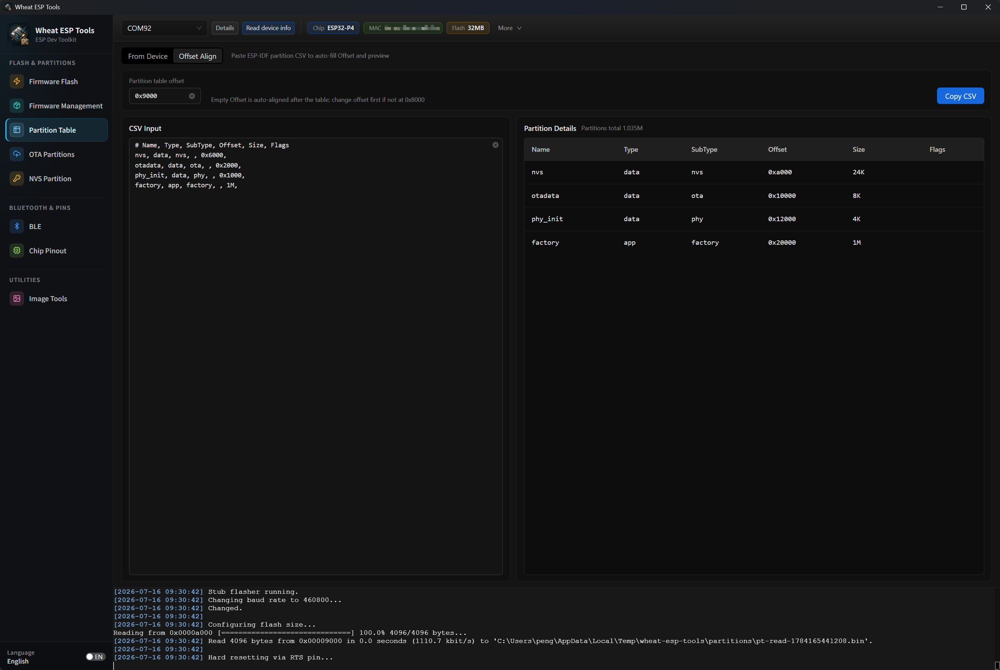
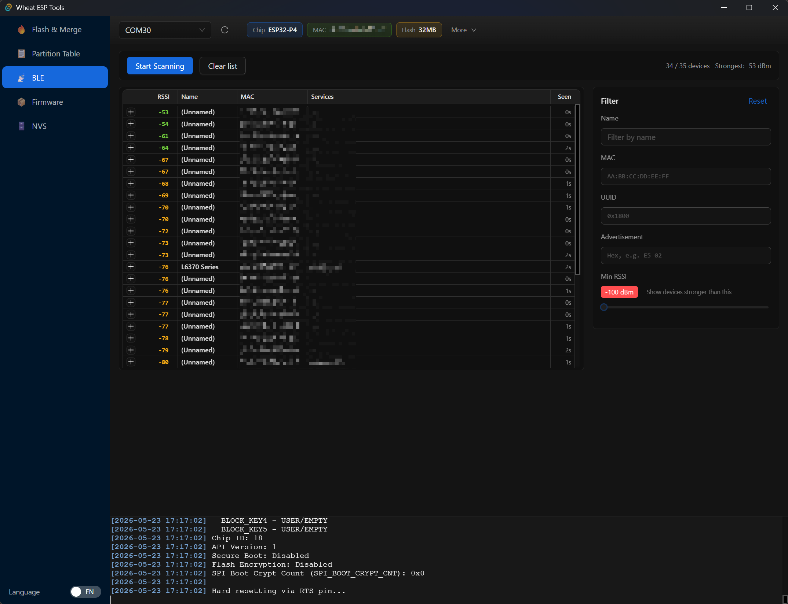
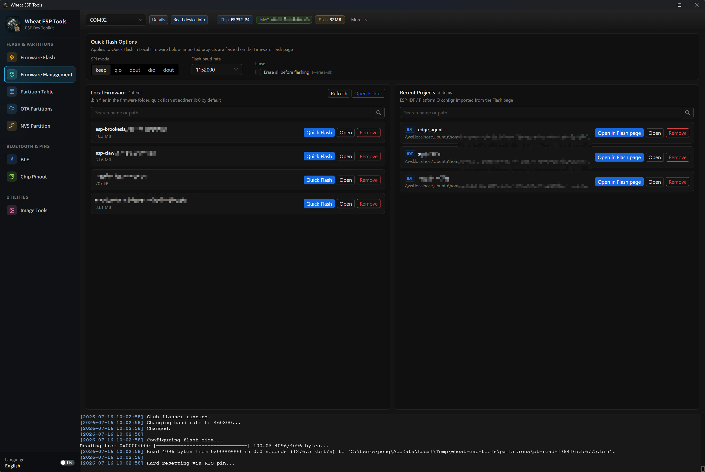
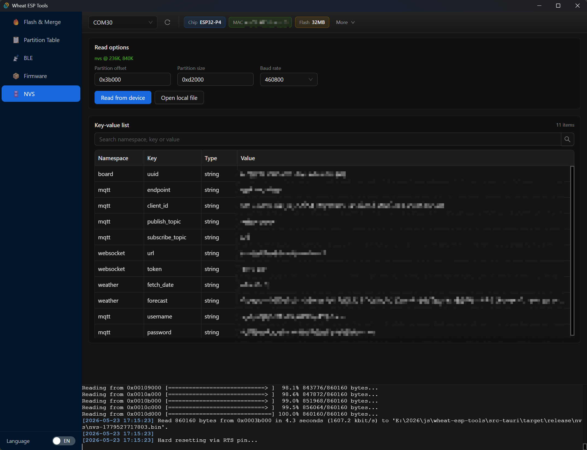
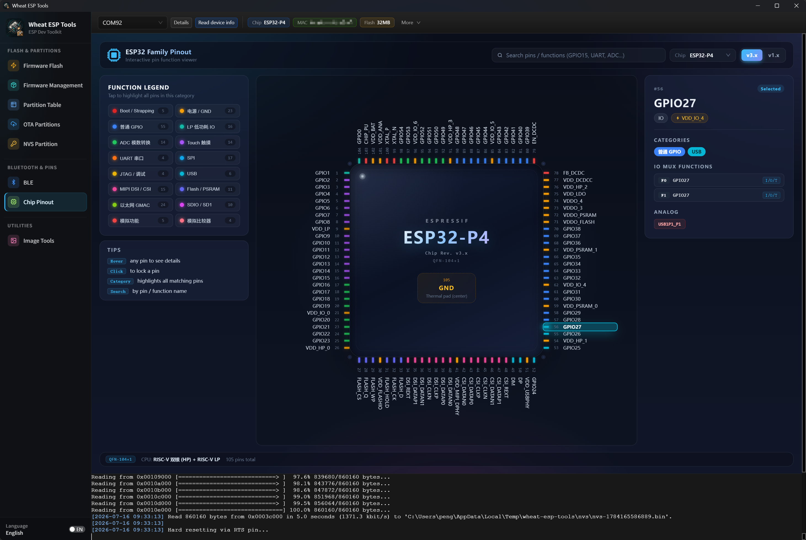

# Wheat ESP Tools

A desktop toolkit for ESP series chips — firmware flashing, merging, partition table editing, NVS read/write, chip pinout reference, and BLE advertisement scanning. Built with [Tauri](https://tauri.app/) and [Vue 3](https://vuejs.org/), with [esptool](https://github.com/espressif/esptool) built in — no separate CLI installation required.

[简体中文](./README.md) | English

---

## Table of Contents

- [Features](#features)
- [Requirements](#requirements)
- [Installation](#installation)
- [Device Connection](#device-connection)
- [Flash & Merge](#flash--merge)
- [Partition Table](#partition-table)
- [Bluetooth BLE](#bluetooth-ble)
- [Firmware Management](#firmware-management)
- [NVS Partition Reader](#nvs-partition-reader)
- [Chip Pinout](#chip-pinout)
- [Terminal Output](#terminal-output)
- [Data Directories](#data-directories)
- [Feature Status](#feature-status)
- [License](#license)

---

## Features

| Module | Description |
|--------|-------------|
| **Flash & Merge** | Multi-firmware batch flash, merge into a single `.bin`, full Flash erase/read |
| **Partition Table** | Auto-align CSV offsets, read partition table from device with visualization |
| **Firmware** | Recent project configs (ESP-IDF / PlatformIO), local firmware quick flash |
| **NVS** | Read NVS partition from device or local file, parse and edit key-value pairs, write back to device, generate from CSV |
| **Chip Pinout** | Interactive ESP32-family pinout with category filtering and pin details |
| **BLE** | Scan nearby BLE advertisements with multi-criteria filtering |
| **Device Info** | Auto-read chip model, MAC, Flash size after selecting a serial port |

---

## Requirements

- **OS**: Windows (primary supported platform)
- **Hardware**: ESP dev board + USB serial driver (CH340, CP2102, etc.)
- **Build from source** (optional): Node.js 18+, Yarn, Rust toolchain

---

## Installation

### Pre-built Installer

Download the installer from [Releases](https://github.com/vaemc/wheat-esp-tools/releases) and run the setup wizard to launch **Wheat ESP Tools**.

### Build from Source

```bash
# Install dependencies
yarn install

# Development mode (hot reload)
yarn tauri dev

# Production build
yarn tauri build
```

Built artifacts are located at `src-tauri/target/release/bundle/`.

---

## Device Connection

1. Connect your ESP board to the PC via USB.
2. Click **Serial port** in the top bar and select the correct COM port (the list refreshes when opened).
3. After selection, esptool reads device info automatically. The bar shows:
   - Chip model (e.g. ESP32, ESP32-S3)
   - MAC address (click to copy)
   - Flash size
   - More details: revision, Flash ID, PSRAM, crystal, features, security info
4. Click the refresh button to re-read device info.

> **Tip**: Most device-dependent actions (flash, read partition table, read NVS, etc.) require a selected port. You'll see "Select a serial port first" if none is chosen.

---

## Flash & Merge



### Adding Firmware

Three ways to populate the firmware list:

#### 1. Drag & drop / select `.bin` files

The tool parses the flash offset from the filename (hex `0x` prefix):

```
FirmwareName_0xOffset.bin
```

Example: `ESP32_0x10000.bin` → offset `0x10000`

Multiple `.bin` files can be added at once.

#### 2. Import ESP-IDF project config

Drop or select:

```
your_project/build/flasher_args.json
```

Parses `flash_files`, chip type, paths, and offsets automatically. The config is also saved under **Firmware → Recent Projects**.

#### 3. Import PlatformIO project config

Drop or select:

```
your_project/.pio/build/your_board/idedata.json
```

Same auto-fill behavior; saved to recent projects.

### Toolbar Options

| Option | Description |
|--------|-------------|
| **SPI mode** | `keep` / `qio` / `qout` / `dio` / `dout` — Flash SPI mode for write |
| **Baud rate** | Default 1152000; options from 115200 to 1500000 |
| **Target chip** | Required for merge; auto-detected from esptool |

### Firmware List Actions

- **Checkbox**: Only checked items are flashed/merged; header checkbox toggles all.
- **Offset**: Editable per row.
- **Flash (row)**: Write a single firmware file.
- **Remove**: Remove from the list.

### Flashing

1. Check the firmware entries and verify offsets.
2. (Optional) Enable **Erase flash before write** (`--erase-all`) for a full erase first.
3. Click **Flash** — progress appears in the bottom terminal.

Equivalent to:

```bash
esptool.py -p COMx -b 1152000 write_flash --flash_mode keep 0x10000 firmware.bin ...
```

### Merging Firmware

Combine multiple `.bin` files by offset into one file (no device write):

1. Select a **Target chip** (required).
2. Check the firmware to merge.
3. Click **Merge**.

Output is saved to the app's `firmware/` folder as `{chip}-merge-bin-{timestamp}.bin` and opened in the file explorer when ready.

### Quick Actions

The toolbar also provides:

- **Erase flash**: Full chip erase (`erase-flash`)
- **Read flash**: Dump entire Flash to `firmware/read-{timestamp}.bin`

---

## Partition Table

Two tabs: **Offset align** and **From device**.

### Offset Align



Auto-calculates **Offset** for ESP-IDF partition CSV:

1. Paste ESP-IDF-format partition CSV in the left text area.
2. Rows with **empty Offset** are aligned per ESP-IDF rules.
3. The right panel shows a live preview table and total Flash usage.
4. Click **Copy** to copy the aligned CSV to the clipboard.

Example input:

```csv
# Name, Type, SubType, Offset, Size, Flags
nvs,      data, nvs,     , 0x6000,
otadata,  data, ota,     , 0x2000,
phy_init, data, phy,     , 0x1000,
factory,  app,  factory, , 1M,
```

### From Device



Read the partition table from Flash offset `0x8000` on a connected device:

1. Set baud rate (default 460800).
2. Click **Read partition table**.
3. On success, view:
   - **Layout chart**: Visual Flash usage by partition
   - **Details table**: Name, Type, SubType, Offset, Size, Flags
   - **CSV output**: Copy as standard CSV

Binary backups are stored in the app's `partitions/` folder.

---

## Bluetooth BLE



Scan nearby BLE advertisement broadcasts (no ESP serial port required).

### Scanning

1. Click **Start Scanning**.
2. Devices are sorted by RSSI (strongest first).
3. Click **Stop Scanning** to end; **Clear list** removes current results.

Devices not seen for 10 seconds are automatically removed.

### Filters

The right panel supports combined filtering:

| Filter | Description |
|--------|-------------|
| **Name** | Fuzzy match on advertised device name |
| **MAC** | Match Bluetooth address |
| **UUID** | Match advertised service UUID |
| **Advertisement** | Hex substring matching raw payload / manufacturer / service data |
| **Min RSSI** | Slider — show only devices stronger than the threshold |

Click **Reset** to restore defaults.

### Device Details

Select a device to view manufacturer data, advertised service UUIDs, service data, raw payload, and advertisement count.

> **Note**: This version supports **advertisement scanning and filtering only**. BLE connection and GATT read/write are not implemented.

---

## Firmware Management



Two panels: **Recent Projects** and **Local Firmware**.

### Recent Projects

Automatically records ESP-IDF / PlatformIO configs imported from the Flash page:

- Shows project name and config file path
- Tags: **IDF** (blue) vs **PIO** (green)
- **Import to Flash**: Load config and jump to the Flash page
- **Open**: Reveal config file in explorer
- **Remove**: Delete from history

Search by name or path is supported.

### Local Firmware

Manages `.bin` files in the app's `firmware/` folder:

- **Open Folder** opens the directory — drop `.bin` files there to list them
- **Quick Flash**: One-click write to offset `0x0` with current flash options
- Flash options (SPI mode, baud rate, erase before write) are configurable next to the button
- Search, open file, and remove list entries

---

## NVS Partition Reader



Read, edit, and write back ESP NVS (Non-Volatile Storage) key-value data.

### Read from Device

1. Ensure a serial port is selected.
2. Set baud rate (default 460800).
3. Click **Read from device**. The workflow:
   - Read partition table from Flash `0x8000`
   - Auto-detect NVS partition offset and size
   - Read NVS binary and parse entries
4. The table shows namespace, key, type, and value.

### Open Local File

Click **Open local file** to parse a `.bin` NVS partition image without a connected device.

### Generate from CSV

Click **Generate from CSV** and select an ESP-IDF standard NVS CSV file to produce a `.bin` partition image (no direct flash). Output is saved to the app's `nvs/` folder.

### Edit & Write Back

After reading or opening an NVS image, you can edit entries in the table:

- **Value**: Non-binary entries support inline editing
- **Delete / Undo**: Mark keys for deletion; undo is supported
- **Revert**: Revert a single row or all pending changes

When edits are ready:

| Action | Description |
|--------|-------------|
| **Export .bin** | Rebuild the modified NVS into a new binary file |
| **Save & flash to device** | Rebuild and write back to the device's NVS partition (only available after **Read from device**) |

A confirmation dialog shows target offset, size, and pending entry count before flashing. Binary-type entries cannot be edited inline.

### Search

Filter by namespace, key, or value content. Unmodified cells can be clicked to copy.

> **Note**: Empty or encrypted partitions may yield no parseable entries. Write-back overwrites the target NVS partition — verify offset and size before proceeding.

Backups from read, export, and CSV generation are saved to the app's `nvs/` folder.

---

## Chip Pinout



Interactive pin-function viewer for the ESP32 chip family. Data is sourced from Espressif official datasheets — no device connection required.

### Supported Chips

ESP32, ESP32-S3, ESP32-C3, ESP32-C5, ESP32-C6, ESP32-P4 (some chips support multiple package variants).

### Basic Usage

1. Select the target chip and package from the **Chip** dropdown at the top.
2. **Hover** any pin to preview details in the right panel; **click** to lock selection.
3. Use **Search** to filter by pin or function name (e.g. `GPIO15`, `UART`, `ADC`).
4. Click a category in the **Function Legend** on the left to highlight all matching pins.

### Pin Details

The right panel shows for the selected pin:

- Function categories (GPIO, UART, SPI, ADC, etc.)
- Boot / Strapping notes (reset sampling timing and caveats)
- Reset state before and after release
- IO MUX / LP IO MUX alternate functions
- Analog capabilities (ADC, DAC, etc.)

The footer shows CPU model, package, and total pin count, with a link to the full datasheet.

---

## Terminal Output

The bottom xterm panel shows:

- Real-time stdout from esptool
- Progress bar during flash/read operations
- Timestamped command logs for troubleshooting

Do not close the app during flashing. On failure, check port conflicts, drivers, wiring, and baud rate.

---

## Data Directories

The app creates these folders at runtime:

| Directory | Contents |
|-----------|----------|
| `firmware/` | Merged firmware, full Flash dumps, local firmware library |
| `partitions/` | Partition table binaries read from device |
| `nvs/` | NVS partition backups from device read, edited export, or CSV generation |

---

## Feature Status

| Feature | Status |
|---------|--------|
| Multi-firmware flash / merge | ✅ Done |
| ESP-IDF / PlatformIO config import | ✅ Done |
| Filename offset parsing | ✅ Done |
| Full Flash erase / read | ✅ Done |
| Partition table offset alignment | ✅ Done |
| Read partition table from device | ✅ Done |
| NVS partition read & parse | ✅ Done |
| NVS edit / export / write back to device | ✅ Done |
| NVS generate from CSV | ✅ Done |
| ESP32-family chip pinout | ✅ Done |
| Recent projects / local firmware | ✅ Done |
| BLE advertisement scan | ✅ Done |
| BLE multi-criteria filtering | ✅ Done |
| BLE connect & GATT operations | ❌ Not implemented |

---

## License

This project is licensed under the [MIT License](./LICENSE).
