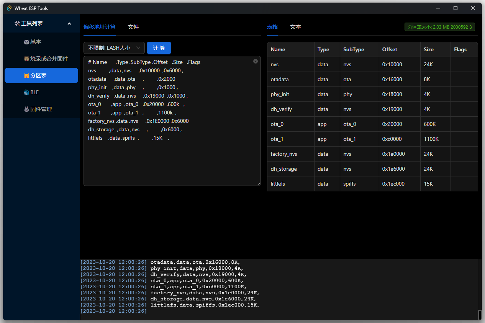
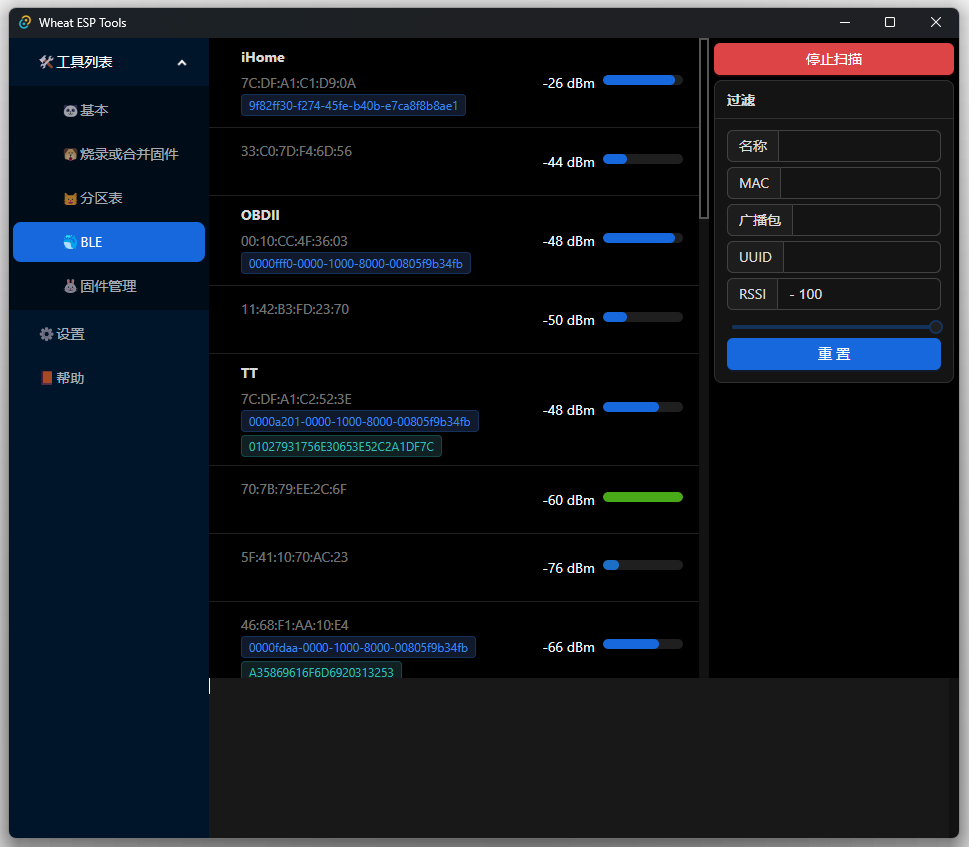

# Wheat ESP Tools

## 基本

## 烧录或合并固件
* 支持将flasher_args.json文件拖入工具解析
* 支持将idf项目文件夹或build文件夹拖入工具解析
  
✅ 烧录

✅ 合并

## 分区表
✅ 填充分区表的偏移地址并对齐

✅ 分区表bin文件转csv

## BLE
✅ 广播扫描

✅ 过滤

❎ 连接蓝牙

## 固件管理
✅ 历史烧录路径

✅ 搜索固件

