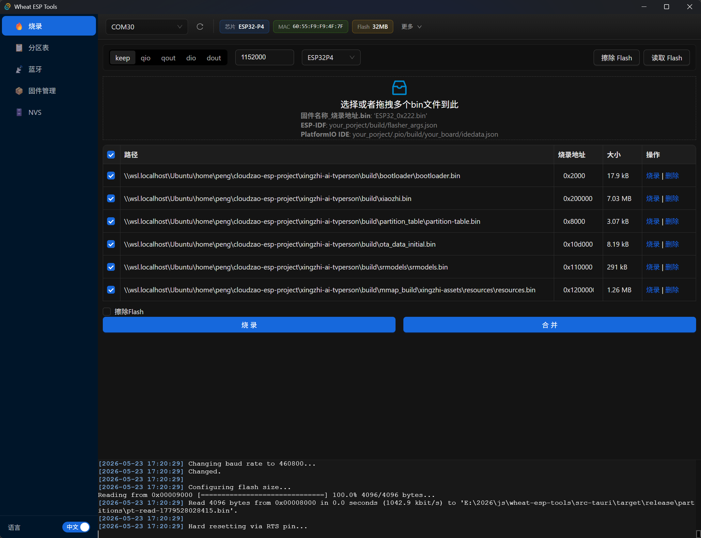
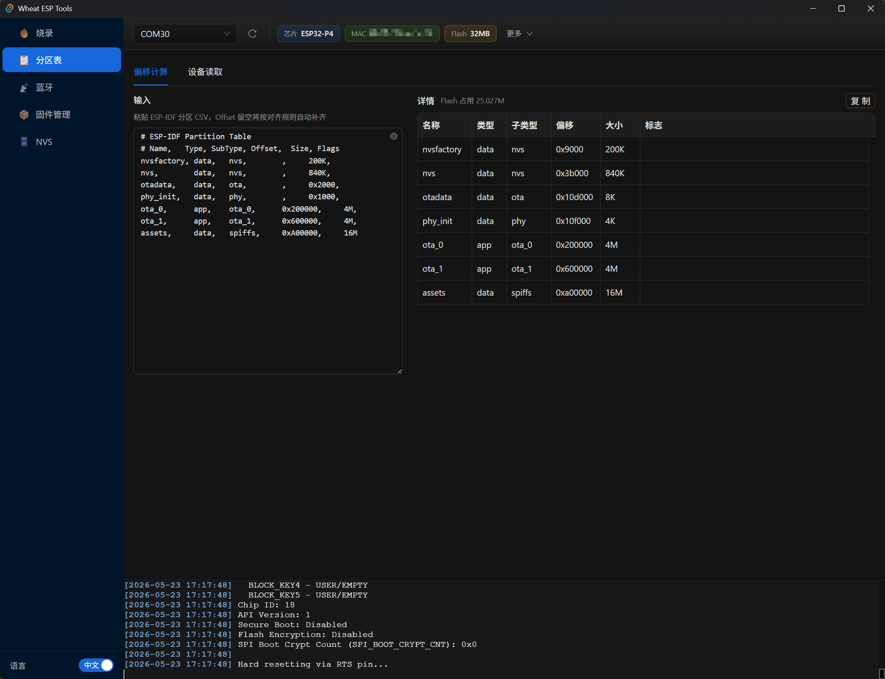
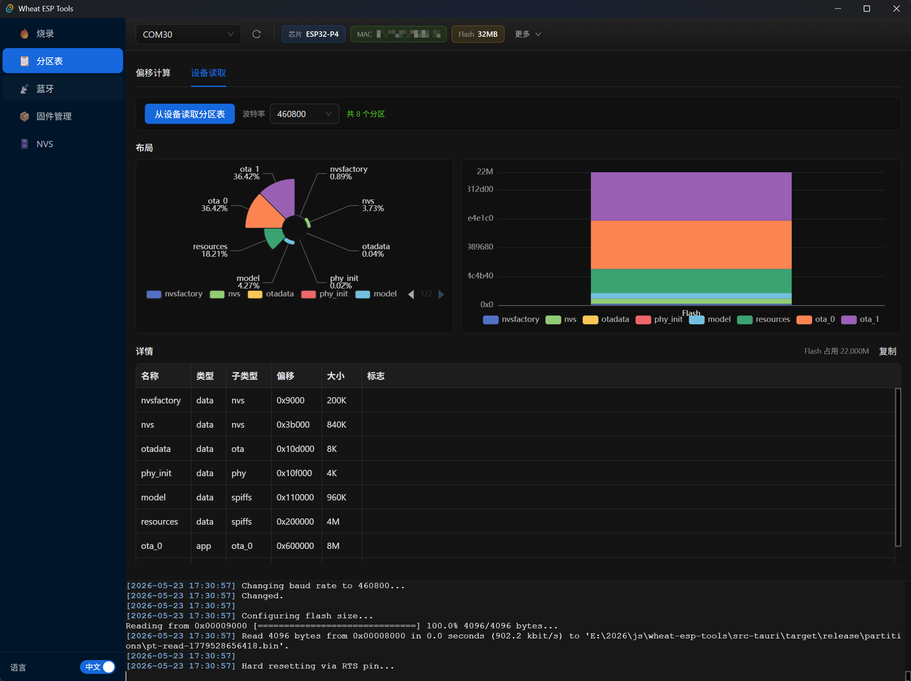
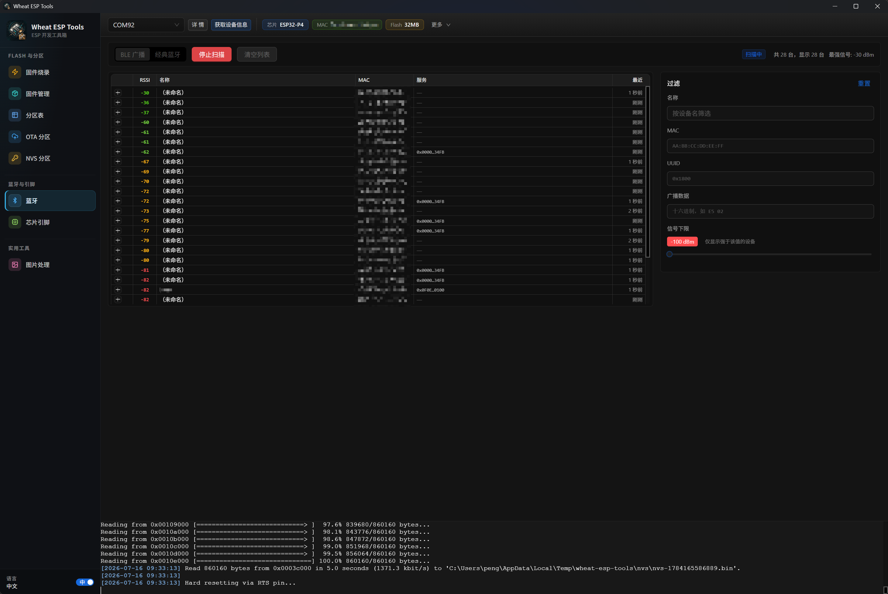
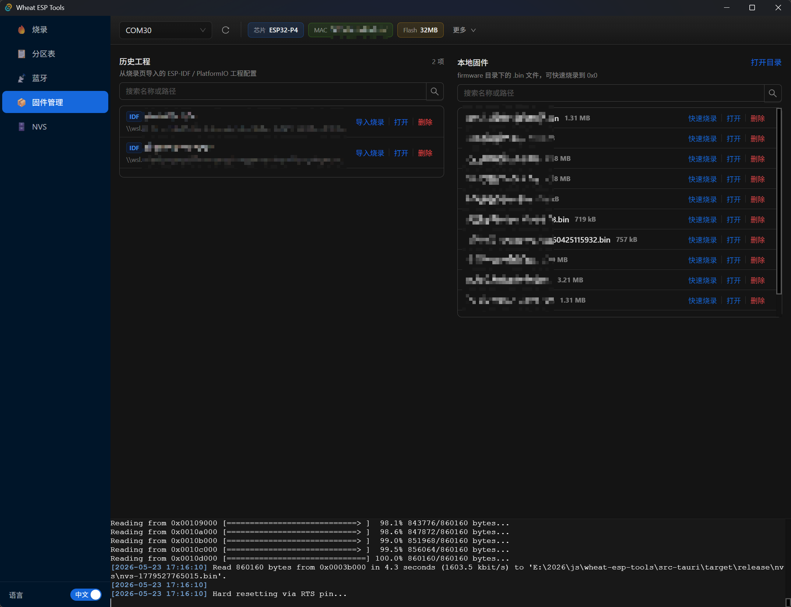
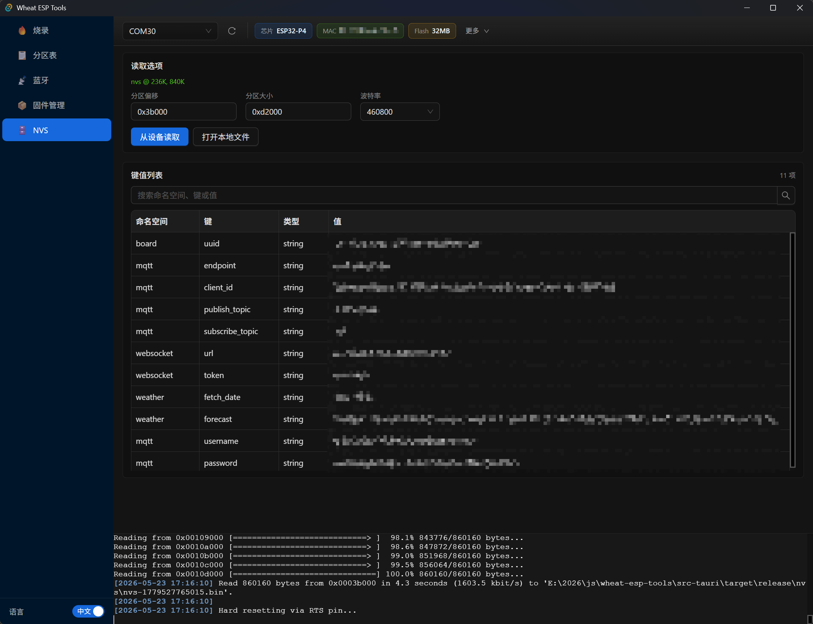
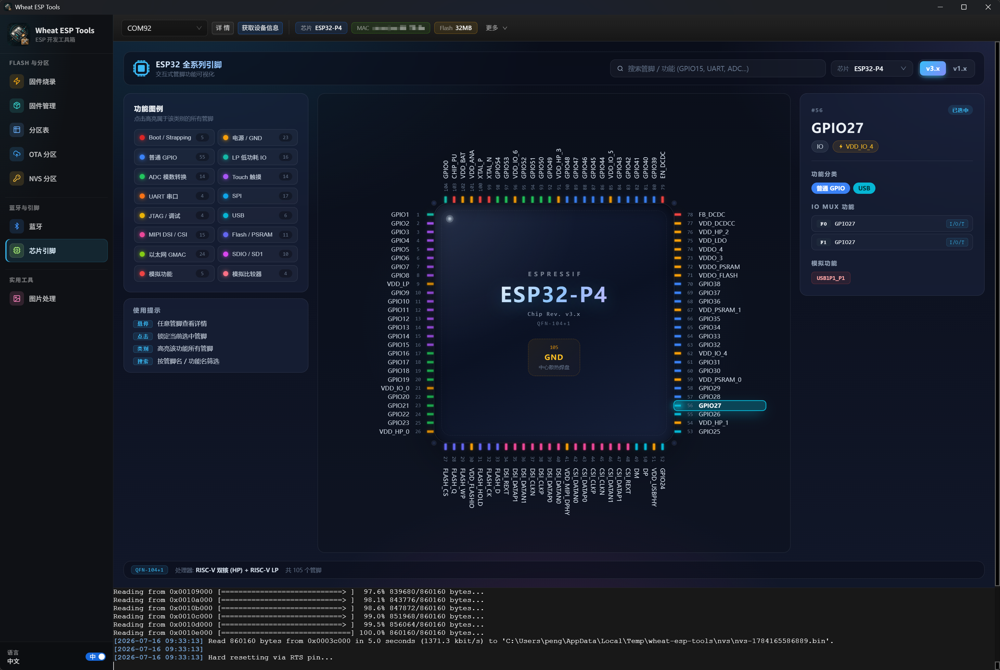

# Wheat ESP Tools

面向 ESP 系列芯片的桌面开发工具，集成固件烧录、合并、分区表编辑、NVS 读写、芯片引脚查询与 BLE 广播扫描等功能。基于 [Tauri](https://tauri.app/) + [Vue 3](https://vuejs.org/) 构建，内置 [esptool](https://github.com/espressif/esptool)，无需额外安装命令行工具。

简体中文 | [English](./README-EN.md)

---

## 目录

- [功能概览](#功能概览)
- [系统要求](#系统要求)
- [安装与运行](#安装与运行)
- [设备连接](#设备连接)
- [烧录与合并](#烧录与合并)
- [分区表](#分区表)
- [蓝牙 BLE](#蓝牙-ble)
- [固件管理](#固件管理)
- [NVS 分区读取](#nvs-分区读取)
- [芯片引脚](#芯片引脚)
- [终端输出](#终端输出)
- [数据目录](#数据目录)
- [功能状态](#功能状态)
- [许可证](#许可证)

---

## 功能概览

| 模块 | 说明 |
|------|------|
| **烧录与合并** | 多固件批量烧录、固件合并为单一 `.bin`、整片 Flash 擦除/读取 |
| **分区表** | CSV 偏移自动对齐计算、从设备读取分区表并可视化 |
| **固件管理** | 历史工程配置（ESP-IDF / PlatformIO）、本地固件快速烧录 |
| **NVS** | 从设备或本地文件读取 NVS 分区，解析、编辑键值对，支持写回设备与 CSV 生成 |
| **芯片引脚** | ESP32 全系列交互式引脚图，按功能分类筛选与详情查看 |
| **蓝牙 BLE** | 扫描附近 BLE 广播设备，支持多条件过滤 |
| **设备信息** | 选择串口后自动读取芯片型号、MAC、Flash 等信息 |

---

## 系统要求

- **操作系统**：Windows（当前主要支持平台）
- **硬件**：ESP 开发板 + USB 串口驱动（CH340、CP2102 等）
- **开发构建**（可选）：Node.js 18+、Yarn、Rust 工具链

---

## 安装与运行

### 使用预编译安装包

从 [Releases](https://github.com/vaemc/wheat-esp-tools/releases) 下载安装包，按向导安装后启动 **Wheat ESP Tools** 即可。

### 从源码构建

```bash
# 安装依赖
yarn install

# 开发模式（热重载）
yarn tauri dev

# 构建生产安装包
yarn tauri build
```

构建产物位于 `src-tauri/target/release/bundle/`。

---

## 设备连接

1. 用 USB 线连接 ESP 开发板与电脑。
2. 点击顶部 **选择串口** 下拉框，选择对应 COM 口（展开时会自动刷新列表）。
3. 选中串口后，工具会通过 esptool 自动读取设备信息，顶部显示：
   - 芯片型号（如 ESP32、ESP32-S3）
   - MAC 地址（点击可复制）
   - Flash 容量
   - 更多详情：修订版本、Flash ID、PSRAM、晶振频率、特性、安全信息等
4. 点击刷新按钮可重新读取设备信息。

> **提示**：大部分需要与设备交互的功能（烧录、读取分区表、读取 NVS 等）都依赖已选择的串口。未选串口时会提示「请先选择串口」。

---

## 烧录与合并



### 添加固件

支持三种方式将固件加入列表：

#### 1. 拖拽/选择 `.bin` 文件

工具会从文件名中自动解析烧录地址（十六进制 `0x` 前缀）：

```
固件名称_0x烧录地址.bin
```

示例：`ESP32_0x10000.bin` → 地址 `0x10000`

可同时拖入多个 `.bin` 文件。

#### 2. 导入 ESP-IDF 工程配置

拖入或选择编译产物目录下的：

```
your_project/build/flasher_args.json
```

工具会自动解析其中的 `flash_files`、芯片类型，并填充固件路径与烧录地址。该配置会同时记入 **固件管理 → 历史工程**。

#### 3. 导入 PlatformIO 工程配置

拖入或选择：

```
your_project/.pio/build/your_board/idedata.json
```

同样会自动解析固件列表与偏移，并保存到历史工程。

### 工具栏参数

| 参数 | 说明 |
|------|------|
| **SPI 模式** | `keep` / `qio` / `qout` / `dio` / `dout`，烧录时写入 Flash 的 SPI 模式 |
| **烧录波特率** | 默认 1152000，可选 115200 ~ 1500000 |
| **芯片类型** | 合并固件时必选，列表由 esptool 自动探测 |

### 固件列表操作

- **勾选**：批量烧录/合并时仅处理已勾选项；表头复选框可全选/取消。
- **烧录地址**：可手动编辑每行偏移。
- **单行烧录**：点击该行「烧录」仅写入该固件。
- **删除**：从列表移除该固件。

### 烧录

1. 勾选要烧录的固件，确认地址无误。
2. （可选）勾选 **烧录前擦除 Flash**（`--erase-all`），整片擦除后再写入。
3. 点击 **烧录** 按钮，底部终端显示进度。

烧录命令等效于：

```bash
esptool.py -p COMx -b 1152000 write_flash --flash_mode keep 0x10000 firmware.bin ...
```

### 合并固件

将多个 `.bin` 按地址合并为单一文件（不写入设备）：

1. 选择 **芯片类型**（必填）。
2. 勾选要合并的固件。
3. 点击 **合并**。

合并结果保存至应用目录下的 `firmware/` 文件夹，命名格式：`{芯片}-merge-bin-{时间戳}.bin`，完成后自动在资源管理器中打开。

### 快捷操作

工具栏还提供：

- **擦除 Flash**：整片擦除（`erase-flash`）
- **读取 Flash**：整片读取并保存为 `firmware/read-{时间戳}.bin`

---

## 分区表

分区表模块包含两个标签页。

### 偏移计算



用于 ESP-IDF 分区 CSV 的 **Offset 自动对齐**：

1. 在左侧文本框粘贴 ESP-IDF 格式的分区 CSV。
2. **Offset 留空** 的分区会按 ESP-IDF 对齐规则自动计算偏移。
3. 右侧表格实时预览对齐结果，并显示 Flash 总占用。
4. 点击 **复制** 可将对齐后的 CSV 复制到剪贴板。

示例输入：

```csv
# Name, Type, SubType, Offset, Size, Flags
nvs,      data, nvs,     , 0x6000,
otadata,  data, ota,     , 0x2000,
phy_init, data, phy,     , 0x1000,
factory,  app,  factory, , 1M,
```

### 设备读取



从已连接设备的 Flash `0x8000` 处读取分区表：

1. 选择波特率（默认 460800）。
2. 点击 **从设备读取分区表**。
3. 读取成功后展示：
   - **布局图**：分区在 Flash 中的可视化占用
   - **详情表格**：名称、类型、子类型、偏移、大小、标志
   - **CSV 输出**：可一键复制为标准 CSV

读取的二进制备份保存在应用目录 `partitions/` 下。

---

## 蓝牙 BLE



扫描电脑蓝牙适配器附近的 BLE 广播设备（无需连接 ESP 串口）。

### 扫描

1. 点击 **开始扫描**。
2. 设备列表按信号强度（RSSI）降序排列。
3. 点击 **停止扫描** 结束；**清空列表** 清除当前结果。

超过 10 秒未再次广播的设备会自动从列表移除。

### 过滤条件

右侧面板支持组合过滤：

| 条件 | 说明 |
|------|------|
| **名称** | 按设备广播名模糊匹配 |
| **MAC** | 按蓝牙地址匹配 |
| **UUID** | 按广播服务 UUID 匹配 |
| **广播数据** | 十六进制片段，匹配原始载荷/厂商数据/服务数据 |
| **信号下限** | RSSI 滑块，仅显示信号强于设定值的设备 |

点击 **重置** 恢复默认过滤。

### 设备详情

点击列表中的设备可查看：厂商数据、广播服务 UUID、服务数据、原始载荷、累计广播次数等。

> **说明**：当前版本仅支持 **广播扫描与过滤**，尚不支持连接蓝牙设备或 GATT 读写。

---

## 固件管理



固件管理分为 **历史工程** 与 **本地固件** 两个面板。

### 历史工程

自动记录从烧录页导入的 ESP-IDF / PlatformIO 配置文件：

- 显示工程名称、配置文件路径
- 标签区分 **IDF**（蓝色）与 **PIO**（绿色）
- **导入烧录**：一键加载配置并跳转到烧录页
- **打开**：在资源管理器中定位配置文件
- **删除**：从历史记录中移除

支持按名称或路径搜索。

### 本地固件

管理应用 `firmware/` 目录下的 `.bin` 文件：

- 点击 **打开目录** 可直接打开该文件夹，将固件放入即可出现在列表中
- **快速烧录**：以 `0x0` 地址、当前烧录参数一键写入设备
- 烧录参数（SPI 模式、波特率、是否擦除）可在快速烧录按钮旁配置
- 支持搜索、打开文件、删除列表项

---

## NVS 分区读取



读取、编辑并写回 ESP NVS（Non-Volatile Storage）分区的键值数据。

### 从设备读取

1. 确保已选择串口。
2. 设置波特率（默认 460800）。
3. 点击 **从设备读取**，流程为：
   - 先从 Flash `0x8000` 读取分区表
   - 自动定位 NVS 分区并填充 **分区偏移** 与 **分区大小**
   - 读取 NVS 二进制并解析键值
4. 下方表格展示：命名空间、键、类型、值

### 打开本地文件

点击 **打开本地文件**，选择 `.bin` 格式的 NVS 分区镜像直接解析，无需连接设备。

### 从 CSV 生成

点击 **从 CSV 生成**，选择 ESP-IDF 标准 NVS CSV 文件，一键生成 `.bin` 分区镜像（不直接烧录）。生成结果保存在应用目录 `nvs/` 下。

### 编辑与写回

读取或打开 NVS 后，可在表格中直接修改：

- **值**：非二进制条目支持内联编辑
- **删除 / 恢复**：标记删除键值，可撤销
- **还原**：单行或全部撤销修改

修改完成后：

| 操作 | 说明 |
|------|------|
| **导出为 .bin** | 将当前修改重建为新的 NVS 二进制文件 |
| **保存并烧录到设备** | 重建二进制并写回设备的 NVS 分区（仅 **从设备读取** 的来源可用） |

写回前会弹出确认框，展示目标偏移、大小与待写入条目数。二进制类型条目暂不支持内联编辑。

### 搜索

支持按命名空间、键名或值内容过滤。未修改的单元格点击可复制。

> **注意**：若分区为空或已加密，可能无法解析出有效键值。写回操作会覆盖目标 NVS 分区，请确认偏移与大小正确。

读取与导出备份保存在应用目录 `nvs/` 下。

---

## 芯片引脚



ESP32 全系列芯片的交互式引脚功能可视化工具，数据来源于 Espressif 官方数据手册，无需连接设备。

### 支持的芯片

ESP32、ESP32-S3、ESP32-C3、ESP32-C5、ESP32-C6、ESP32-P4（部分芯片支持多封装变体切换）。

### 基本操作

1. 顶部 **芯片** 下拉框选择目标型号与封装。
2. **悬停** 任意管脚可在右侧查看详情；**点击** 锁定选中管脚。
3. **搜索** 框支持按管脚名或功能名（如 `GPIO15`、`UART`、`ADC`）筛选高亮。
4. 左侧 **功能图例** 点击某一类别，高亮该功能下的所有管脚。

### 管脚详情

右侧面板展示选中管脚的：

- 功能分类（GPIO、UART、SPI、ADC 等）
- Boot / Strapping 说明（复位采样时机与注意事项）
- 复位前后电平状态
- IO MUX / LP IO MUX 复用功能
- 模拟功能（ADC、DAC 等）

底部显示处理器型号、封装与管脚总数，可跳转查看完整数据手册。

---

## 终端输出

应用底部集成 xterm 终端，用于：

- 实时显示 esptool 命令的标准输出
- 烧录/读取时显示进度条
- 带时间戳的命令日志，便于排查问题

烧录过程中请勿关闭应用；若失败，请检查串口占用、驱动、接线及波特率设置。

---

## 数据目录

应用运行目录下会自动创建以下文件夹：

| 目录 | 内容 |
|------|------|
| `firmware/` | 合并固件、整片读取备份、本地固件库 |
| `partitions/` | 从设备读取的分区表二进制 |
| `nvs/` | 从设备读取、编辑导出或 CSV 生成的 NVS 分区备份 |

---

## 功能状态

| 功能 | 状态 |
|------|------|
| 多固件烧录 / 合并 | ✅ 已完成 |
| ESP-IDF / PlatformIO 配置导入 | ✅ 已完成 |
| 文件名解析烧录地址 | ✅ 已完成 |
| 整片 Flash 擦除 / 读取 | ✅ 已完成 |
| 分区表偏移对齐 | ✅ 已完成 |
| 从设备读取分区表 | ✅ 已完成 |
| NVS 分区读取与解析 | ✅ 已完成 |
| NVS 键值编辑 / 导出 / 写回设备 | ✅ 已完成 |
| NVS 从 CSV 生成 | ✅ 已完成 |
| ESP32 全系列芯片引脚图 | ✅ 已完成 |
| 历史工程 / 本地固件管理 | ✅ 已完成 |
| BLE 广播扫描 | ✅ 已完成 |
| BLE 多条件过滤 | ✅ 已完成 |
| BLE 连接与 GATT 操作 | ❌ 未实现 |

---

## 许可证

本项目采用 [MIT License](./LICENSE) 开源。
