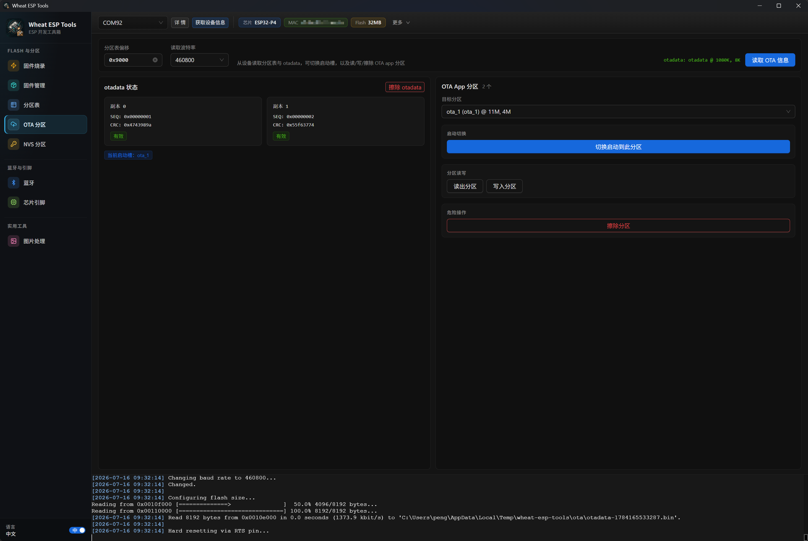
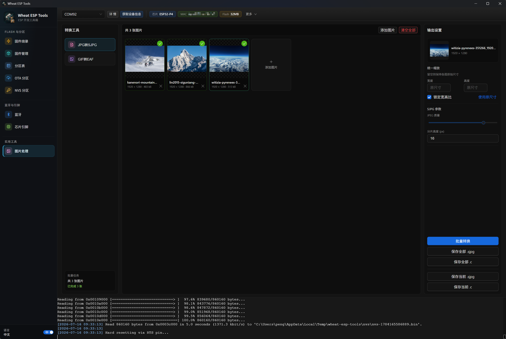
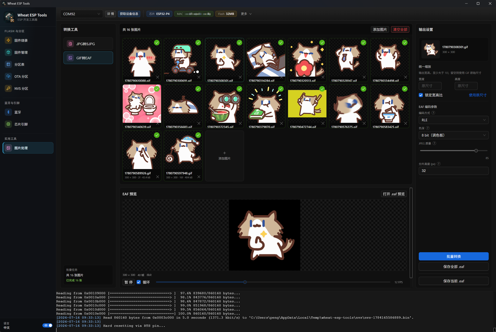
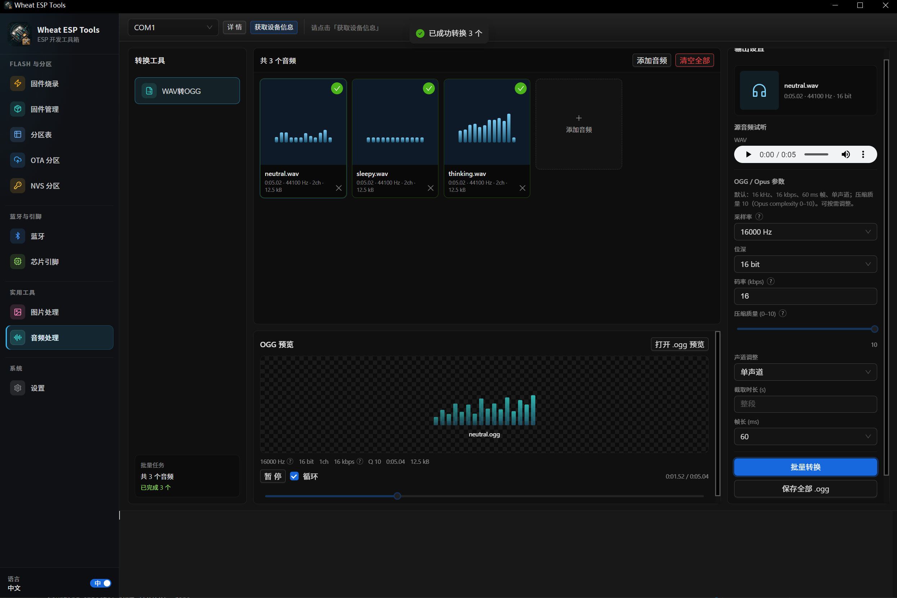

# Wheat ESP Tools

面向 ESP 系列芯片的桌面工具。集成固件烧录与合并、分区表、OTA、NVS、蓝牙扫描、芯片引脚图、嵌入式图片与音频格式转换等功能。基于 [Tauri](https://tauri.app/) 与 [Vue 3](https://vuejs.org/) 构建，内置 [esptool](https://github.com/espressif/esptool)，无需另行安装命令行工具。

简体中文 | [English](./README-EN.md)

---

## 目录

- [概述](#概述)
- [功能一览](#功能一览)
- [系统要求](#系统要求)
- [安装与运行](#安装与运行)
- [界面结构](#界面结构)
- [设备连接](#设备连接)
- [固件烧录](#固件烧录)
- [固件管理](#固件管理)
- [分区表](#分区表)
- [OTA 分区](#ota-分区)
- [NVS 分区](#nvs-分区)
- [蓝牙](#蓝牙)
- [芯片引脚](#芯片引脚)
- [图片处理](#图片处理)
- [音频处理](#音频处理)
- [终端输出](#终端输出)
- [数据目录](#数据目录)
- [功能状态](#功能状态)
- [许可证](#许可证)

---

## 概述

Wheat ESP Tools 将常见的 ESP 开发操作集中到同一桌面应用中，覆盖从串口烧录到分区维护、蓝牙侦测与资源转换的完整链路。串口相关操作通过内置 esptool 完成；蓝牙扫描与 NVS / GIF→EAF 等能力由 Tauri 原生端实现。

侧栏按用途分为三组：

| 分组 | 模块 |
|------|------|
| Flash 与分区 | 固件烧录、固件管理、分区表、OTA 分区、NVS 分区 |
| 蓝牙与引脚 | 蓝牙、芯片引脚 |
| 实用工具 | 图片处理、音频处理 |

界面语言支持简体中文与 English，可在应用内切换。

---

## 功能一览

| 模块 | 说明 |
|------|------|
| 固件烧录 | 多固件列表管理、批量/单行烧录、合并为单一 `.bin`、导出副本、整片擦除与读取 |
| 固件管理 | ESP-IDF / PlatformIO 历史工程、本地固件库与快速烧录 |
| 分区表 | CSV 偏移对齐、从设备读取并可视化、单分区读/写/擦 |
| OTA 分区 | 解析 otadata、切换启动槽、OTA App 分区读/写/擦 |
| NVS 分区 | 设备或本地读取、键值编辑、写回设备、CSV 生成镜像 |
| 蓝牙 | BLE 广播扫描与过滤；Windows 经典蓝牙（BR/EDR）发现 |
| 芯片引脚 | ESP32 系列交互式引脚图，按功能筛选与手册跳转 |
| 图片处理 | JPG→SJPG、GIF→EAF，面向 LVGL / 嵌入式显示 |
| 音频处理 | WAV→OGG（Opus），面向语音唤醒 / 嵌入式播报等场景 |

---

## 系统要求

| 项目 | 要求 |
|------|------|
| 操作系统 | Windows（当前主要支持平台；经典蓝牙依赖 WinRT） |
| 硬件 | ESP 开发板，以及可用的 USB 串口驱动（如 CH340、CP2102） |
| 源码构建（可选） | Node.js 18+、Yarn、Rust 工具链 |

---

## 安装与运行

### 预编译安装包

从 [Releases](https://github.com/vaemc/wheat-esp-tools/releases) 下载安装包，按向导安装后启动 **Wheat ESP Tools**。

### 从源码构建

```bash
yarn install
yarn tauri dev      # 开发模式
yarn tauri build    # 生产安装包
```

构建产物位于 `src-tauri/target/release/bundle/`。

---

## 界面结构

| 区域 | 内容 |
|------|------|
| 顶部栏 | 串口选择、设备信息、「获取设备信息」 |
| 左侧栏 | 功能菜单（按分组排列） |
| 主区域 | 当前工具页；页面切换时保留近期状态（最多 6 页） |
| 底部栏 | xterm 终端，输出 esptool 日志与进度 |

默认打开 **固件烧录** 页。

---

## 设备连接

与设备交互的功能（烧录、分区表、OTA、NVS 等）均依赖顶部栏已选择的串口。未选串口时，相关操作会提示先选择串口。

### 操作步骤

1. 用 USB 连接开发板与电脑。
2. 打开顶部 **选择串口** 下拉框（展开时自动刷新 COM 列表），选定目标端口。
3. 点击 **获取设备信息**，通过 esptool 读取芯片与 Flash 信息。
4. 切换串口后，已缓存的设备信息会清空，需重新获取。

### 可显示信息

- 芯片型号、修订版本
- MAC 地址（可复制）
- Flash 容量、类型、Flash ID
- PSRAM、晶振频率、特性摘要
- 安全信息等详情（「更多」面板）

串口详情还可查看友好名称、USB 描述与序列号。

> 设备信息不会在选中串口后自动读取，需手动点击「获取设备信息」。

---

## 固件烧录

多固件烧录、合并与 Flash 级快捷操作的主入口。

<!-- 截图占位：固件烧录主界面 -->


### 添加固件

支持三种来源：

#### 1. 拖入或选择 `.bin`

可从文件名中解析首个十六进制烧录地址（`0x` 前缀）：

```
固件名称_0x烧录地址.bin
```

示例：`ESP32_0x10000.bin` → 地址 `0x10000`。可同时添加多个文件，地址也可在列表中手动修改。

#### 2. ESP-IDF 工程配置

选择或拖入编译产物中的：

```
your_project/build/flasher_args.json
```

解析 `flash_files` 与芯片类型，填充固件列表，并记入 **固件管理 → 历史工程**。

#### 3. PlatformIO 工程配置

选择或拖入：

```
your_project/.pio/build/your_board/idedata.json
```

解析方式与 ESP-IDF 类似，同样写入历史工程。

### 工具栏参数

| 参数 | 说明 |
|------|------|
| SPI 模式 | `keep` / `qio` / `qout` / `dio` / `dout`，默认 `keep` |
| 烧录波特率 | 默认 `1152000`，可选约 `115200`–`1500000` |
| 芯片类型 | 由 esptool 探测；**合并固件时必选** |

### 列表操作

- 勾选：批量烧录 / 合并 / 导出仅处理已勾选项；表头可全选
- 烧录地址：逐行编辑
- 烧录此项：仅写入当前行
- 删除：从列表移除

### 烧录

1. 勾选目标固件并确认地址。
2. 可选勾选 **烧录前整片擦除**（`--erase-all`）。
3. 点击 **烧录**，进度与日志见底部终端。

等价命令示例：

```bash
esptool.py -p COMx -b 1152000 write-flash --flash-mode keep 0x10000 firmware.bin ...
```

### 合并固件

将多个 `.bin` 按地址合并为单一文件（不写入设备）：

1. 选择芯片类型。
2. 勾选要合并的固件。
3. 点击 **合并**，可确认输出文件名。

结果保存在应用目录 `firmware/`，默认命名 `{芯片}-merge-bin-{时间戳}.bin`，完成后打开所在文件夹。

### 导出

将勾选固件复制到用户指定目录，命名形如 `{文件名}_{地址}.bin`。

### 快捷操作

| 操作 | 说明 |
|------|------|
| 整片擦除 | `erase-flash`（波特率固定 115200） |
| 读取 Flash | `read-flash 0 ALL`，保存为 `firmware/read-{时间戳}.bin`（波特率 460800） |

---

## 固件管理

管理历史工程配置与本地固件库，并提供快速烧录入口。

<!-- 截图占位：固件管理 -->


页面顶部可配置快速烧录参数：SPI 模式、波特率、是否烧录前擦除（与烧录页参数体系一致，默认波特率 `1152000`、SPI `keep`）。

### 历史工程

自动记录从烧录页导入的 ESP-IDF / PlatformIO 配置：

- 展示工程名称与配置路径；标签区分 **IDF** / **PIO**
- 按名称或路径搜索
- **导入到烧录页**：加载配置并跳转烧录页
- **打开**：在资源管理器中定位配置文件
- **删除**：移除历史记录

### 本地固件

扫描应用目录 `firmware/` 下的 `.bin`：

- **打开目录**：将文件放入该目录后刷新即可出现在列表
- **快速烧录**：以地址 `0x0` 及当前快速烧录参数写入设备（需已选串口）
- 支持搜索、打开文件、删除列表项

---

## 分区表

包含 **设备读取** 与 **偏移计算** 两个子页。分区表偏移默认 `0x8000`，可修改并在应用中持久保存。

### 设备读取

从已连接设备读取分区表，并支持按分区操作。

<!-- 截图占位：分区表 · 设备读取 -->


1. 确认分区表偏移与读取波特率（默认 `460800`）。
2. 点击 **读取分区表**。
3. 展示内容包括：
   - Flash 布局与容量对比图
   - 详情表：名称、类型、子类型、偏移、大小、标志
   - 标准 CSV（可复制）
4. 每一行分区可执行 **读取 / 写入 / 擦除**：
   - 读取：导出为临时 `.bin` 并打开所在目录
   - 写入：选择不超过分区大小的 `.bin`，写入后 hard-reset
   - 擦除：需确认后执行

分区表二进制备份位于系统临时目录 `wheat-esp-tools/partitions/`；单分区读出位于 `wheat-esp-tools/partition/`。

### 偏移计算

用于 ESP-IDF 分区 CSV 的 Offset 自动对齐，无需连接设备。

<!-- 截图占位：分区表 · 偏移计算 -->


1. 在左侧粘贴分区 CSV。
2. **Offset 留空** 的行按 ESP-IDF 对齐规则自动计算。
3. 右侧实时预览结果与 Flash 总占用。
4. **复制** 可将对齐后的 CSV 写入剪贴板。

示例输入：

```csv
# Name, Type, SubType, Offset, Size, Flags
nvs,      data, nvs,     , 0x6000,
otadata,  data, ota,     , 0x2000,
phy_init, data, phy,     , 0x1000,
factory,  app,  factory, , 1M,
```

---

## OTA 分区

读取设备分区表与 `otadata`，查看当前启动槽，并对 OTA App 分区进行维护。需已选串口，且分区表中存在 `otadata` 与 OTA App 分区（如 `ota_0`、`ota_1`）。

<!-- 截图占位：OTA 分区 -->


### 读取信息

设置分区表偏移（默认 `0x8000`）与波特率（默认 `460800`），点击 **读取 OTA 信息**。成功后显示：

- otadata 双副本：SEQ、CRC、有效/无效
- 当前启动槽（active slot）
- 检测到的 otadata 分区偏移与大小

### 操作

| 类别 | 操作 | 说明 |
|------|------|------|
| 启动切换 | 切换启动到所选 OTA 分区 | 改写 otadata，复位后生效 |
| 分区读写 | 读出 / 写入所选 OTA 分区 | 写入 **不会** 自动切换启动槽 |
| 危险操作 | 擦除 otadata / 擦除所选 OTA 分区 | 均有确认框；擦除 otadata 后通常回退 factory 或默认策略 |

读出文件示例路径：`{临时目录}/wheat-esp-tools/ota/ota_{n}-{时间戳}.bin`。

---

## NVS 分区

读取、编辑并写回 ESP NVS（Non-Volatile Storage）键值数据；也可从本地镜像或 CSV 生成分区文件。

<!-- 截图占位：NVS 分区 -->


### 从设备读取

1. 选择串口，确认分区表偏移（默认 `0x8000`）与波特率（默认 `460800`）。
2. 点击 **从设备读取**：先读分区表，自动定位 NVS 的偏移与大小，再读取并解析键值。
3. 表格展示命名空间、键、类型、值。

默认占位偏移/大小为 `0x9000` / `0x6000`，设备探测成功后会被覆盖。分区大小须为 `0x1000` 的整数倍。

### 打开本地文件

选择 `.bin` 格式的 NVS 分区镜像直接解析，无需连接设备。

### 从 CSV 生成

选择 ESP-IDF 标准 NVS CSV，生成 `.bin` 分区镜像（不直接烧录）。结果写入系统临时目录。

### 编辑与写回

| 操作 | 说明 |
|------|------|
| 改值 | 非 binary 条目支持内联编辑 |
| 删除 / 恢复 | 标记删除，可撤销 |
| 还原 | 单行或全部撤销修改 |
| 导出为 .bin | 按当前编辑结果重建二进制 |
| 写回设备 | 仅「从设备读取」来源可用；确认后覆盖原 NVS 分区 |

写回前会展示目标偏移、大小与待写入条目数。binary 类型暂不支持内联编辑。

### 搜索与复制

可按命名空间、键名或值过滤。未修改的单元格点击可复制。

> 空分区或已加密分区可能无法解析出有效键值。写回会覆盖目标 NVS 分区，请确认偏移与大小正确。临时文件位于 `{临时目录}/wheat-esp-tools/nvs/`。

---

## 蓝牙

扫描附近蓝牙设备。本页不依赖 ESP 串口。提供两种模式：**BLE 广播** 与 **经典蓝牙**（Windows）。

<!-- 截图占位：蓝牙 -->


### BLE 广播

1. 选择 **BLE 广播** 模式，点击 **开始扫描**。
2. 设备按 RSSI 降序排列；超过约 10 秒未再广播的条目会自动移除。
3. **停止扫描** / **清空列表** 分别结束扫描与清除结果。

右侧过滤条件可组合使用：

| 条件 | 说明 |
|------|------|
| 名称 | 广播名模糊匹配 |
| MAC | 蓝牙地址匹配 |
| UUID | 广播服务 UUID |
| 广播数据 | 十六进制片段，匹配原始载荷 / 厂商数据 / 服务数据 |
| 信号下限 | RSSI 滑块，默认约 -100 dBm |

展开设备行可查看厂商数据、服务 UUID、服务数据、原始载荷、累计广播次数等。

> 当前仅支持广播扫描与过滤，不支持连接设备或 GATT 读写。

### 经典蓝牙（Windows）

通过系统设备发现机制扫描 BR/EDR 设备，列表可显示名称、MAC、Class of Device、主类别、配对/连接/认证状态，以及系统推送的 RSSI（部分设备可能无 RSSI）。

过滤项包括：名称、MAC、仅已配对、仅已连接、RSSI 下限。同样不提供连接或协议层读写。

---

## 芯片引脚

ESP32 系列交互式引脚功能图。数据来自 Espressif 官方数据手册，无需连接设备。

<!-- 截图占位：芯片引脚 -->


### 支持的芯片

| 芯片 | 封装说明 |
|------|----------|
| ESP32 | QFN-48 |
| ESP32-S3 | QFN-56+1 |
| ESP32-C3 | QFN-32+1 |
| ESP32-C5 | QFN-40+1 |
| ESP32-C6 | QFN-40+1 |
| ESP32-P4 | QFN-104+1（含封装/版本变体） |

### 操作

1. 选择芯片型号与封装。
2. **悬停** 管脚可在右侧预览详情；**点击** 锁定选中。
3. 搜索框按管脚名或功能名筛选高亮（如 `GPIO15`、`UART`、`ADC`）。
4. 左侧功能图例点击某一类别，高亮该功能下的全部管脚。

### 管脚详情

- 功能分类（GPIO、UART、SPI、ADC 等）
- Boot / Strapping 说明
- 复位前后电平
- IO MUX / LP IO MUX 复用
- 模拟功能（ADC、DAC 等）

底部显示处理器、封装与管脚数，并可跳转对应数据手册。

---

## 图片处理

将常见图片转换为嵌入式/LVGL 可用格式。左侧选择转换工具，中间为批量任务区，右侧为输出参数。

### JPG 转 SJPG


面向 LVGL SJPG 格式（magic `_SJPG__`，版本 V1.00），与官方 `jpg_to_sjpg.py` 流程兼容：按分片高度切条后 JPEG 压缩。

| 项目 | 说明 |
|------|------|
| 输入 | JPG / PNG / WebP / BMP，支持批量 |
| 输出 | `.sjpg` 二进制，或 `.c` 源码数组 |
| 输出尺寸 | 默认原图；可指定宽高（1–4096，可锁比例） |
| JPEG 质量 | 默认 90（约 50–100） |
| 分片高度 | 默认 16 px（约 8–64，步进 8） |

流程：添加图片 → 调整参数 → 批量转换 → 保存单个或全部输出。

### GIF 转 EAF


将 GIF 转为 `.eaf` 动画二进制，并支持预览播放。

| 项目 | 说明 |
|------|------|
| 输入 | GIF（可多文件） |
| 输出 | `.eaf` |
| 编码方式 | **RLE**（默认）、RLE+Huffman、JPEG |
| 色深 | RLE：4 / 8 bit（默认 8）；JPEG 固定 24 bit |
| JPEG 质量 | 默认 85（约 11–100，仅 JPEG 模式） |
| 分片高度 | 默认 32 px（常见 16–32） |
| 输出尺寸 | 默认沿用 GIF；可改（1–4096，且需大于 10） |

编码方式差异简述：RLE 解码快、体积适中；RLE+Huffman 更小、解码稍慢；JPEG 可在画质与体积间调节。转换在原生端执行，预览支持播放/暂停/循环；亦可打开已有 `.eaf` 预览。

---

## 音频处理

将 WAV 转为嵌入式常用的 Ogg Opus（`.ogg`）。布局与图片处理一致：左侧选择转换工具，中间为批量任务区，右侧为输出参数，底部可预览结果。转换在前端完成（`libopus-wasm`），无需本机安装 ffmpeg。

### WAV 转 OGG

<!-- 截图占位：WAV 转 OGG -->


将 PCM / IEEE Float WAV（含 WAVE_FORMAT_EXTENSIBLE）转为 Ogg Opus。

| 项目 | 说明 |
|------|------|
| 输入 | `.wav`，支持批量拖入或系统对话框选择 |
| 输出 | `.ogg`（Opus） |
| 采样率 | 8000 / 12000 / 16000 / 24000 / 48000 Hz（默认 16000） |
| 码率 | 目标码率 kbps（默认 16） |
| 位深 | 编码前中间 PCM 量化：16 / 24 / 32 bit（默认 16） |
| 压缩质量 | Opus complexity 0–10（默认 10）；主要影响音质与耗时，几乎不改变体积 |
| 声道 | 默认单声道；可选保持原声道或强制立体声 |
| 截取时长 | 默认整段；可按秒截取 |
| 帧长 | 20 / 40 / 60 ms（默认 60） |

流程：添加 WAV → 调整参数 → 批量转换 → 保存单个或全部 `.ogg`。底部预览支持播放/暂停/循环，也可打开已有 `.ogg` 试听。

> Opus 文件用 `ffprobe` 查看时，`sample_rate` 常显示为 48000（解码时钟），与设置的编码采样率（写入 OpusHead）不是同一字段；预览中带 `~` 的码率为按体积估算，短音频会因容器开销偏高。

---

## 终端输出

应用底部集成 xterm，用于：

- 显示 esptool 标准输出
- 烧录、读取等操作的进度
- 带时间戳的命令日志（`[YYYY-MM-DD HH:mm:ss]`）

烧录过程中请勿关闭应用。失败时优先检查串口占用、驱动、接线与波特率。终端内可用 Ctrl+C 复制选中文本。

---

## 数据目录

### 应用运行目录

| 目录 | 内容 |
|------|------|
| `firmware/` | 合并固件、整片 Flash 读取备份、本地固件库 |

### 系统临时目录（`{temp}/wheat-esp-tools/`）

| 子目录 | 内容 |
|--------|------|
| `partitions/` | 分区表读取备份 |
| `partition/` | 单分区读出 |
| `nvs/` | NVS 读出、导出、CSV 生成 |
| `ota/` | OTA / otadata 相关备份 |

---

## 功能状态

| 功能 | 状态 |
|------|------|
| 多固件烧录 / 合并 / 导出 | 已完成 |
| ESP-IDF / PlatformIO 配置导入 | 已完成 |
| 文件名解析烧录地址 | 已完成 |
| 整片 Flash 擦除 / 读取 | 已完成 |
| 分区表偏移对齐 | 已完成 |
| 从设备读取分区表与可视化 | 已完成 |
| 单分区读 / 写 / 擦 | 已完成 |
| OTA 读写、切换启动槽、擦除 otadata | 已完成 |
| NVS 读取、编辑、导出、写回、CSV 生成 | 已完成 |
| 历史工程 / 本地固件快速烧录 | 已完成 |
| BLE 广播扫描与多条件过滤 | 已完成 |
| 经典蓝牙扫描（Windows） | 已完成 |
| ESP32 系列芯片引脚图 | 已完成 |
| JPG→SJPG / GIF→EAF | 已完成 |
| WAV→OGG（Opus） | 已完成 |
| 蓝牙连接与 GATT 操作 | 未实现 |

---

## 许可证

本项目采用 [MIT License](./LICENSE) 开源。
