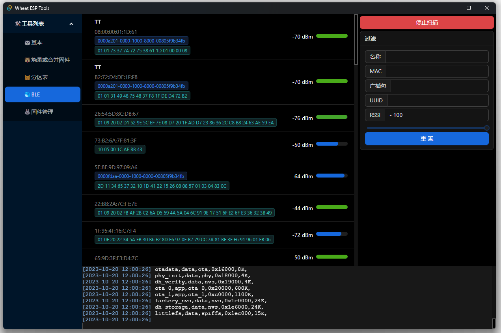

# Wheat ESP Tools

简体中文 | [English](./README-EN.md)

## 常规

## 烧录或合并固件
* 支持文件名中解析固件: 
  固件名称_烧录地址.bin: 'ESP32_0x222.bin'
  
* 支持导入ESP-IDF项目的固件到工具列表

  your_porject/build/flasher_args.json

* 支持导入PlatformIO IDE项目的固件到工具列表

  your_porject/.pio/build/your_board/idedata.json

## 分区表
✅ 填充分区表的偏移地址并对齐

✅ 分区表固件转CSV

## BLE
✅ 广播扫描

❎ 差广播过滤未完成

❎ 连接蓝牙

## 固件管理
✅ 历史烧录路径

✅ 搜索固件

